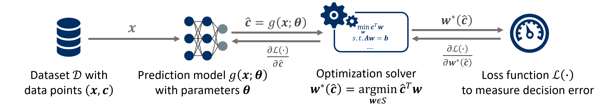

# PyEPO: A PyTorch-based End-to-End Predict-then-Optimize Tool

<p align="center"></p>


## Learning Framework

<p align="center"></p>


## Publication

This repository is the official implementation of the paper:
[PyEPO: A PyTorch-based End-to-End Predict-then-Optimize Library for Linear and Integer Programming](https://arxiv.org/abs/2206.14234) (Accepted to Mathematical Programming Computation (MPC))

Citation:
```
@article{tang2022pyepo,
  title={PyEPO: A PyTorch-based End-to-End Predict-then-Optimize Library for Linear and Integer Programming},
  author={Tang, Bo and Khalil, Elias B},
  journal={arXiv preprint arXiv:2206.14234},
  year={2022}
}
```


## Introduction

``PyEPO`` (PyTorch-based End-to-End Predict-then-Optimize Tool) is a Python-based, open-source software that supports modeling and solving predict-then-optimize problems with the linear objective function. The core capability of ``PyEPO`` is to build optimization models with [GurobiPy](https://www.gurobi.com/), [Pyomo](http://www.pyomo.org/), or any other solvers and algorithms, then embed the optimization model into an artificial neural network for the end-to-end training. For this purpose, ``PyEPO`` implements various methods as [PyTorch](https://pytorch.org/) autograd modules.


## Documentation

The official ``PyEPO`` docs can be found at [https://khalil-research.github.io/PyEPO](https://khalil-research.github.io/PyEPO).


## Tutorial

- [](https://colab.research.google.com/github/khalil-research/PyEPO/blob/main/notebooks/01%20Optimization%20Model.ipynb)**01 Optimization Model:** Build up optimization solver
- [](https://colab.research.google.com/github/khalil-research/PyEPO/blob/main/notebooks/02%20Optimization%20Dataset.ipynb)**02 Optimization Dataset:** Generate synthetic data and use optDataset
- [](https://colab.research.google.com/github/khalil-research/PyEPO/blob/main/notebooks/03%20Training%20and%20Testing.ipynb)**03 Training and Testing:** Train and test different approaches
- [](https://colab.research.google.com/github/khalil-research/PyEPO/blob/main/notebooks/04%202D%20knapsack%20Solution%20Visualization.ipynb)**04 2D knapsack Solution Visualization:** Visualize solutions for knapsack problem
- [](https://colab.research.google.com/github/khalil-research/PyEPO/blob/main/notebooks/05%20Warcraft%20Shortest%20Path.ipynb)**05 Warcraft Shortest Path:** Use the Warcraft terrains dateset to train shortest path


## Experiments

To reproduce the experiments in original paper, please use the code and follow the instruction in this [branch](https://github.com/khalil-research/PyEPO/tree/MPC).


## Features

- Implement **SPO+** [[1]](https://doi.org/10.1287/mnsc.2020.3922), **DBB** [[3]](https://arxiv.org/abs/1912.02175), **NID** [[7]](https://arxiv.org/abs/2205.15213), **DPO** [[4]](https://papers.nips.cc/paper/2020/hash/6bb56208f672af0dd65451f869fedfd9-Abstract.html), **PFYL** [[4]](https://papers.nips.cc/paper/2020/hash/6bb56208f672af0dd65451f869fedfd9-Abstract.html), **NCE** [[5]](https://www.ijcai.org/proceedings/2021/390) and **LTR** [[6]](https://proceedings.mlr.press/v162/mandi22a.htm), **I-MLE** [[8]](https://proceedings.neurips.cc/paper_files/paper/2021/hash/7a430339c10c642c4b2251756fd1b484-Abstract.html), and **AI-MLE** [[9]](https://ojs.aaai.org/index.php/AAAI/article/view/26103).
- Support [Gurobi](https://www.gurobi.com/), [COPT](https://shanshu.ai/copt), and [Pyomo](http://www.pyomo.org/) API
- Support Parallel computing for optimization solver
- Support solution caching [[5]](https://www.ijcai.org/proceedings/2021/390) to speed up training

## Installation

### Clone and Install from this Repo

You can download ``PyEPO`` from our GitHub repository.

```bash
git clone -b main --depth 1 https://github.com/khalil-research/PyEPO.git
```

And install it.

```bash
pip install PyEPO/pkg/.
```

### Pip Install

The package is now available on [PyPI](https://pypi.org/project/pyepo/) for installation. You can easily install `PyEPO` using pip by running the following command:

```bash
pip install pyepo
```

### Conda Install

`PyEPO` is also available on [Anaconda Cloud](https://anaconda.org/pyepo/pyepo). If you prefer to use conda for installation, you can install `PyEPO` with the following command:

```bash
conda install -c pyepo pyepo
```


## Dependencies

* [NumPy](https://numpy.org/)
* [SciPy](https://scipy.org/)
* [Pathos](https://pathos.readthedocs.io/)
* [tqdm](https://tqdm.github.io/)
* [Pyomo](http://www.pyomo.org/)
* [Gurobi](https://www.gurobi.com/)
* [Scikit Learn](https://scikit-learn.org/)
* [PyTorch](http://pytorch.org/)


## Sample Code

```python
#!/usr/bin/env python
# coding: utf-8

import gurobipy as gp
from gurobipy import GRB
import numpy as np
import pyepo
from pyepo.model.grb import optGrbModel
import torch
from torch import nn
from torch.utils.data import DataLoader


# optimization model
class myModel(optGrbModel):
    def __init__(self, weights):
        self.weights = np.array(weights)
        self.num_item = len(weights[0])
        super().__init__()

    def _getModel(self):
        # ceate a model
        m = gp.Model()
        # varibles
        x = m.addVars(self.num_item, name="x", vtype=GRB.BINARY)
        # model sense
        m.modelSense = GRB.MAXIMIZE
        # constraints
        m.addConstr(gp.quicksum([self.weights[0,i] * x[i] for i in range(self.num_item)]) <= 7)
        m.addConstr(gp.quicksum([self.weights[1,i] * x[i] for i in range(self.num_item)]) <= 8)
        m.addConstr(gp.quicksum([self.weights[2,i] * x[i] for i in range(self.num_item)]) <= 9)
        return m, x


# prediction model
class LinearRegression(nn.Module):

    def __init__(self):
        super(LinearRegression, self).__init__()
        self.linear = nn.Linear(num_feat, num_item)

    def forward(self, x):
        out = self.linear(x)
        return out


if __name__ == "__main__":

    # generate data
    num_data = 1000 # number of data
    num_feat = 5 # size of feature
    num_item = 10 # number of items
    weights, x, c = pyepo.data.knapsack.genData(num_data, num_feat, num_item,
                                                dim=3, deg=4, noise_width=0.5, seed=135)

    # init optimization model
    optmodel = myModel(weights)

    # init prediction model
    predmodel = LinearRegression()
    # set optimizer
    optimizer = torch.optim.Adam(predmodel.parameters(), lr=1e-2)
    # init SPO+ loss
    spop = pyepo.func.SPOPlus(optmodel, processes=1)

    # build dataset
    dataset = pyepo.data.dataset.optDataset(optmodel, x, c)
    # get data loader
    dataloader = DataLoader(dataset, batch_size=32, shuffle=True)

    # training
    num_epochs = 10
    for epoch in range(num_epochs):
        for data in dataloader:
            x, c, w, z = data
            # forward pass
            cp = predmodel(x)
            loss = spop(cp, c, w, z)
            # backward pass
            optimizer.zero_grad()
            loss.backward()
            optimizer.step()

    # eval
    regret = pyepo.metric.regret(predmodel, optmodel, dataloader)
    print("Regret on Training Set: {:.4f}".format(regret))

```


## Reference
* [1] [Elmachtoub, A. N., & Grigas, P. (2021). Smart “predict, then optimize”. Management Science.](https://doi.org/10.1287/mnsc.2020.3922)
* [2] [Mandi, J., Stuckey, P. J., & Guns, T. (2020). Smart predict-and-optimize for hard combinatorial optimization problems. In Proceedings of the AAAI Conference on Artificial Intelligence.](https://doi.org/10.1609/aaai.v34i02.5521)
* [3] [Vlastelica, M., Paulus, A., Musil, V., Martius, G., & Rolínek, M. (2019). Differentiation of blackbox combinatorial solvers. arXiv preprint arXiv:1912.02175.](https://arxiv.org/abs/1912.02175)
* [4] [Berthet, Q., Blondel, M., Teboul, O., Cuturi, M., Vert, J. P., & Bach, F. (2020). Learning with differentiable pertubed optimizers. Advances in neural information processing systems, 33, 9508-9519.](https://papers.nips.cc/paper/2020/hash/6bb56208f672af0dd65451f869fedfd9-Abstract.html)
* [5] [Mulamba, M., Mandi, J., Diligenti, M., Lombardi, M., Bucarey, V., & Guns, T. (2021). Contrastive losses and solution caching for predict-and-optimize. Proceedings of the Thirtieth International Joint Conference on Artificial Intelligence.](https://www.ijcai.org/proceedings/2021/390)
* [6] [Mandi, J., Bucarey, V., Mulamba, M., & Guns, T. (2022). Decision-focused learning: through the lens of learning to rank. Proceedings of the 39th International Conference on Machine Learning.](https://proceedings.mlr.press/v162/mandi22a.html)
* [7] [Sahoo, S. S., Paulus, A., Vlastelica, M., Musil, V., Kuleshov, V., & Martius, G. (2022). Backpropagation through combinatorial algorithms: Identity with projection works. arXiv preprint arXiv:2205.15213.](https://arxiv.org/abs/2205.15213)
* [8] [Niepert, M., Minervini, P., & Franceschi, L. (2021). Implicit MLE: backpropagating through discrete exponential family distributions. Advances in Neural Information Processing Systems, 34, 14567-14579.](https://proceedings.neurips.cc/paper_files/paper/2021/hash/7a430339c10c642c4b2251756fd1b484-Abstract.html)
* [9] [Minervini, P., Franceschi, L., & Niepert, M. (2023, June). Adaptive perturbation-based gradient estimation for discrete latent variable models. In Proceedings of the AAAI Conference on Artificial Intelligence (Vol. 37, No. 8, pp. 9200-9208).](https://ojs.aaai.org/index.php/AAAI/article/view/26103)
