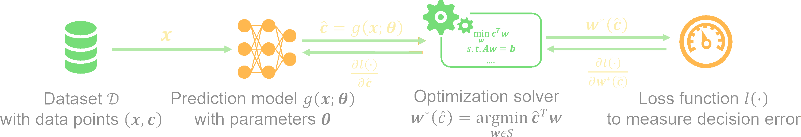

# PyEPO: A PyTorch-based End-to-End Predict-then-Optimize Tool

[](https://opensource.org/licenses/MIT)
[](https://github.com/khalil-research/PyEPO/stargazers)
[](https://github.com/khalil-research/PyEPO/actions/workflows/test.yml)
[](https://pypi.org/project/pyepo/)

[](https://pypi.org/project/pyepo/)
[](https://pepy.tech/project/pyepo)
[](https://anaconda.org/pyepo/pyepo)
[](https://anaconda.org/pyepo/pyepo)
[](https://khalil-research.github.io/PyEPO)
[](https://link.springer.com/article/10.1007/s12532-024-00255-x)

<p align="center"></p>


## Learning Framework

<p align="center"></p>

## Publication

This repository is the official implementation of the paper:
[PyEPO: A PyTorch-based End-to-End Predict-then-Optimize Library for Linear and Integer Programming](https://link.springer.com/article/10.1007/s12532-024-00255-x) (Accepted to Mathematical Programming Computation (MPC))

Citation:
```
@article{tang2024,
  title={PyEPO: a PyTorch-based end-to-end predict-then-optimize library for linear and integer programming},
  author={Tang, Bo and Khalil, Elias B},
  journal={Mathematical Programming Computation},
  issn={1867-2957},
  doi={10.1007/s12532-024-00255-x},
  year={2024},
  month={July},
  publisher={Springer}
}
```

If you use the **CaVE** loss, please also cite:
```
@inproceedings{tang2024cave,
  title={CaVE: A Cone-Aligned Approach for Fast Predict-then-Optimize with Binary Linear Programs},
  author={Tang, Bo and Khalil, Elias B},
  booktitle={Integration of Constraint Programming, Artificial Intelligence, and Operations Research},
  pages={193--210},
  year={2024},
  publisher={Springer}
}
```


## Introduction

``PyEPO`` (PyTorch-based End-to-End Predict-then-Optimize Tool) is a Python-based, open-source software that supports modeling and solving predict-then-optimize problems with linear objective functions. The core capability of ``PyEPO`` is to build optimization models with [GurobiPy](https://www.gurobi.com/), [COPT](https://shanshu.ai/copt), [Pyomo](http://www.pyomo.org/), [Google OR-Tools](https://developers.google.com/optimization), [MPAX](https://github.com/MIT-Lu-Lab/MPAX) or any other solvers and algorithms, then embed the optimization model into an artificial neural network for the end-to-end training. For this purpose, ``PyEPO`` implements various methods as [PyTorch](https://pytorch.org/) autograd modules.

For end-to-end learning on **binary linear programs** (TSP, CVRP, knapsack, ...), ``PyEPO`` ships **CaVE** [[13]](https://link.springer.com/chapter/10.1007/978-3-031-60599-4_12). CaVE replaces the per-step ILP solve with a cone-alignment projection onto the binding-constraint normals at the true optimum; backed by an interior-point QP solver (Clarabel) with a low iteration cap, this delivers paper-faithful regret on TSP-scale binary LPs. Because the cone projection is far cheaper than the per-instance ILP solve, CaVE trains an order of magnitude faster than SPO+ at this scale.

In particular, ``PyEPO`` integrates [MPAX](https://github.com/MIT-Lu-Lab/MPAX), a JAX-based mathematical programming solver using the PDHG (Primal-Dual Hybrid Gradient) algorithm for GPU-accelerated optimization. MPAX brings three key advantages for end-to-end training: (1) **GPU-native solving** — the first-order PDHG method is inherently parallelizable and runs efficiently on GPU; (2) **batch solving** — an entire mini-batch of optimization instances can be solved simultaneously on GPU via vectorization; and (3) **no GPU–CPU data transfer overhead** — traditional solvers (e.g., Gurobi) run on CPU, requiring costly data transfers between GPU and CPU at every training iteration, whereas MPAX keeps both the neural network and the solver on GPU, eliminating this bottleneck.


## Documentation

The official ``PyEPO`` docs can be found at [https://khalil-research.github.io/PyEPO](https://khalil-research.github.io/PyEPO).

## Slides

Our recent tutorial was at the ACC 2024 conference. You can view the talk slides [here](https://github.com/khalil-research/PyEPO/blob/main/slides/PyEPO.pdf).

## Tutorial

- [](https://colab.research.google.com/github/khalil-research/PyEPO/blob/main/notebooks/01%20Optimization%20Model.ipynb)**01 Optimization Model:** Build an optimization solver
- [](https://colab.research.google.com/github/khalil-research/PyEPO/blob/main/notebooks/02%20Optimization%20Dataset.ipynb)**02 Optimization Dataset:** Generate synthetic data and use optDataset
- [](https://colab.research.google.com/github/khalil-research/PyEPO/blob/main/notebooks/03%20Training%20and%20Testing.ipynb)**03 Training and Testing:** Train and test different approaches
- [](https://colab.research.google.com/github/khalil-research/PyEPO/blob/main/notebooks/04%20CaVE%20for%20Binary%20Linear%20Programs.ipynb)**04 CaVE for Binary Linear Programs:** Train with the cone-aligned CaVE loss vs SPO+ on TSP
- [](https://colab.research.google.com/github/khalil-research/PyEPO/blob/main/notebooks/05%202D%20knapsack%20Solution%20Visualization.ipynb)**05 2D knapsack Solution Visualization:** Visualize solutions for the knapsack problem
- [](https://colab.research.google.com/github/khalil-research/PyEPO/blob/main/notebooks/06%20Warcraft%20Shortest%20Path.ipynb)**06 Warcraft Shortest Path:** Train shortest path models on the Warcraft terrains dataset
- [](https://colab.research.google.com/github/khalil-research/PyEPO/blob/main/notebooks/07%20Real-World%20Energy%20Scheduling.ipynb)**07 Real-World Energy Scheduling:** Apply PyEPO to real energy data
- [](https://colab.research.google.com/github/khalil-research/PyEPO/blob/main/notebooks/08%20kNN%20Robust%20Losses.ipynb)**08 kNN Robust Losses:** Use optDatasetKNN for robust losses
- [](https://colab.research.google.com/github/khalil-research/PyEPO/blob/main/notebooks/09%20Solving%20on%20MPAX%20with%20PDHG.ipynb)**09 Solving on MPAX with PDHG:** Use MPAX for GPU-accelerated batch solving


## Experiments

To **reproduce the experiments** in the original paper, please use the code and follow the instructions in this [branch](https://github.com/khalil-research/PyEPO/tree/MPC). Please note that this branch is a very early version.


## Features

- **End-to-end gradient surrogates** for predict-then-optimize, covering the seven families in the docs:
  - *Surrogate losses* — convex upper bound on regret (**SPO+** [[1]](https://doi.org/10.1287/mnsc.2020.3922)) and finite-difference directional gradient (**PG** [[11]](https://arxiv.org/abs/2402.03256)).
  - *Perturbed methods* — Monte-Carlo gradients over random cost perturbations: **DPO** and **PFYL** [[5]](https://papers.nips.cc/paper/2020/hash/6bb56208f672af0dd65451f869fedfd9-Abstract.html) [[6]](https://arxiv.org/abs/2207.13513), **I-MLE** [[9]](https://proceedings.neurips.cc/paper_files/paper/2021/hash/7a430339c10c642c4b2251756fd1b484-Abstract.html), **AI-MLE** [[10]](https://ojs.aaai.org/index.php/AAAI/article/view/26103).
  - *Regularized methods* — L2-regularized Frank-Wolfe over the convex hull of feasible solutions: **RFWO** and **RFYL** [[6]](https://arxiv.org/abs/2207.13513).
  - *Black-box methods* — informative gradient estimates that replace the solver's zero gradient: **DBB** [[3]](https://arxiv.org/abs/1912.02175) (interpolation) and **NID** [[4]](https://arxiv.org/abs/2205.15213) (signed identity).
  - *Cone-aligned estimation* — supervise the predicted cost by projecting onto the binding-constraint normals at the true optimum; binary linear programs only: **CaVE** [[13]](https://link.springer.com/chapter/10.1007/978-3-031-60599-4_12) — an order of magnitude faster than SPO+ at TSP scale.
  - *Contrastive methods* — margin against a cached pool of non-optimal solutions: **NCE** and **CMAP** [[7]](https://www.ijcai.org/proceedings/2021/390).
  - *Learning to rank* — rank the true optimum highest among the pool: pointwise / pairwise / listwise **LTR** [[8]](https://proceedings.mlr.press/v162/mandi22a.html).
- **Multi-solver backend** under a unified `optModel` API: [Gurobi](https://www.gurobi.com/), [COPT](https://shanshu.ai/copt), [Pyomo](http://www.pyomo.org/), [Google OR-Tools](https://developers.google.com/optimization), and the GPU-native [MPAX](https://github.com/MIT-Lu-Lab/MPAX) PDHG solver.
- **Parallel solving** via a Pathos worker pool to amortize per-instance ILP solves across a mini-batch.
- **Solution caching** [[7]](https://www.ijcai.org/proceedings/2021/390) reuses previously computed optima to skip redundant solver calls in contrastive and ranking training.
- **kNN-smoothed targets** [[12]](https://arxiv.org/abs/2310.04328) replace each label with a neighborhood aggregate for noise-robust regret.

## Installation

### Clone and Install from this Repo

You can download ``PyEPO`` from our GitHub repository.

```bash
git clone -b main --depth 1 https://github.com/khalil-research/PyEPO.git
```

And install it.

```bash
pip install PyEPO/pkg/.
```

### Pip Install

The package is now available for installation on [PyPI](https://pypi.org/project/pyepo/). You can easily install `PyEPO` using pip by running the following command:

```bash
pip install pyepo
```

### Conda Install

`PyEPO` is also available on [Anaconda Cloud](https://anaconda.org/pyepo/pyepo). If you prefer to use conda for installation, you can install `PyEPO` with the following command:

```bash
conda install -c pyepo pyepo
```


## Dependencies

* [NumPy](https://numpy.org/)
* [SciPy](https://scipy.org/)
* [Pathos](https://pathos.readthedocs.io/)
* [tqdm](https://tqdm.github.io/)
* [Pyomo](http://www.pyomo.org/)
* [Gurobi](https://www.gurobi.com/)
* [Scikit Learn](https://scikit-learn.org/)
* [PyTorch](http://pytorch.org/)


## Sample Code

```python
#!/usr/bin/env python
# coding: utf-8

import gurobipy as gp
from gurobipy import GRB
import numpy as np
import pyepo
from pyepo.model.grb import optGrbModel
import torch
from torch import nn
from torch.utils.data import DataLoader


# optimization model
class myModel(optGrbModel):
    def __init__(self, weights):
        self.weights = np.array(weights)
        self.num_item = len(weights[0])
        super().__init__()

    def _getModel(self):
        # create a model
        m = gp.Model()
        # variables
        x = m.addVars(self.num_item, name="x", vtype=GRB.BINARY)
        # model sense
        m.modelSense = GRB.MAXIMIZE
        # constraints
        m.addConstr(gp.quicksum([self.weights[0,i] * x[i] for i in range(self.num_item)]) <= 7)
        m.addConstr(gp.quicksum([self.weights[1,i] * x[i] for i in range(self.num_item)]) <= 8)
        m.addConstr(gp.quicksum([self.weights[2,i] * x[i] for i in range(self.num_item)]) <= 9)
        return m, x


# prediction model
class LinearRegression(nn.Module):

    def __init__(self):
        super(LinearRegression, self).__init__()
        self.linear = nn.Linear(num_feat, num_item)

    def forward(self, x):
        out = self.linear(x)
        return out


if __name__ == "__main__":

    # generate data
    num_data = 1000 # number of data
    num_feat = 5 # size of feature
    num_item = 10 # number of items
    weights, x, c = pyepo.data.knapsack.genData(num_data, num_feat, num_item,
                                                dim=3, deg=4, noise_width=0.5, seed=135)

    # init optimization model
    optmodel = myModel(weights)

    # init prediction model
    predmodel = LinearRegression()
    # set optimizer
    optimizer = torch.optim.Adam(predmodel.parameters(), lr=1e-2)
    # init SPO+ loss
    spop = pyepo.func.SPOPlus(optmodel, processes=1)

    # build dataset
    dataset = pyepo.data.dataset.optDataset(optmodel, x, c)
    # get data loader
    dataloader = DataLoader(dataset, batch_size=32, shuffle=True)

    # training
    num_epochs = 10
    for epoch in range(num_epochs):
        for data in dataloader:
            x, c, w, z = data
            # forward pass
            cp = predmodel(x)
            loss = spop(cp, c, w, z)
            # backward pass
            optimizer.zero_grad()
            loss.backward()
            optimizer.step()

    # eval
    regret = pyepo.metric.regret(predmodel, optmodel, dataloader)
    print("Regret on Training Set: {:.4f}".format(regret))

```


## Reference
* [1] [Elmachtoub, A. N., & Grigas, P. (2021). Smart “predict, then optimize”. Management Science.](https://doi.org/10.1287/mnsc.2020.3922)
* [2] [Mandi, J., Stuckey, P. J., & Guns, T. (2020). Smart predict-and-optimize for hard combinatorial optimization problems. In Proceedings of the AAAI Conference on Artificial Intelligence.](https://doi.org/10.1609/aaai.v34i02.5521)
* [3] [Vlastelica, M., Paulus, A., Musil, V., Martius, G., & Rolínek, M. (2019). Differentiation of blackbox combinatorial solvers. arXiv preprint arXiv:1912.02175.](https://arxiv.org/abs/1912.02175)
* [4] [Sahoo, S. S., Paulus, A., Vlastelica, M., Musil, V., Kuleshov, V., & Martius, G. (2022). Backpropagation through combinatorial algorithms: Identity with projection works. arXiv preprint arXiv:2205.15213.](https://arxiv.org/abs/2205.15213)
* [5] [Berthet, Q., Blondel, M., Teboul, O., Cuturi, M., Vert, J. P., & Bach, F. (2020). Learning with differentiable perturbed optimizers. Advances in neural information processing systems, 33, 9508-9519.](https://papers.nips.cc/paper/2020/hash/6bb56208f672af0dd65451f869fedfd9-Abstract.html)
* [6] [Dalle, G., Baty, L., Bouvier, L., & Parmentier, A. (2022). Learning with Combinatorial Optimization Layers: a Probabilistic Approach. arXiv:2207.13513.](https://arxiv.org/abs/2207.13513)
* [7] [Mulamba, M., Mandi, J., Diligenti, M., Lombardi, M., Bucarey, V., & Guns, T. (2021). Contrastive losses and solution caching for predict-and-optimize. Proceedings of the Thirtieth International Joint Conference on Artificial Intelligence.](https://www.ijcai.org/proceedings/2021/390)
* [8] [Mandi, J., Bucarey, V., Mulamba, M., & Guns, T. (2022). Decision-focused learning: through the lens of learning to rank. Proceedings of the 39th International Conference on Machine Learning.](https://proceedings.mlr.press/v162/mandi22a.html)
* [9] [Niepert, M., Minervini, P., & Franceschi, L. (2021). Implicit MLE: backpropagating through discrete exponential family distributions. Advances in Neural Information Processing Systems, 34, 14567-14579.](https://proceedings.neurips.cc/paper_files/paper/2021/hash/7a430339c10c642c4b2251756fd1b484-Abstract.html)
* [10] [Minervini, P., Franceschi, L., & Niepert, M. (2023, June). Adaptive perturbation-based gradient estimation for discrete latent variable models. In Proceedings of the AAAI Conference on Artificial Intelligence (Vol. 37, No. 8, pp. 9200-9208).](https://ojs.aaai.org/index.php/AAAI/article/view/26103)
* [11] [Gupta, V., & Huang, M. (2024). Decision-Focused Learning with Directional Gradients. Training, 50(100), 150.](https://arxiv.org/abs/2402.03256)
* [12] [Schutte, N., Postek, K., & Yorke-Smith, N. (2023). Robust Losses for Decision-Focused Learning. arXiv preprint arXiv:2310.04328.](https://arxiv.org/abs/2310.04328)
* [13] [Tang, B., & Khalil, E. B. (2024). CaVE: A Cone-Aligned Approach for Fast Predict-then-Optimize with Binary Linear Programs. In Integration of Constraint Programming, Artificial Intelligence, and Operations Research (pp. 193-210).](https://link.springer.com/chapter/10.1007/978-3-031-60599-4_12)
