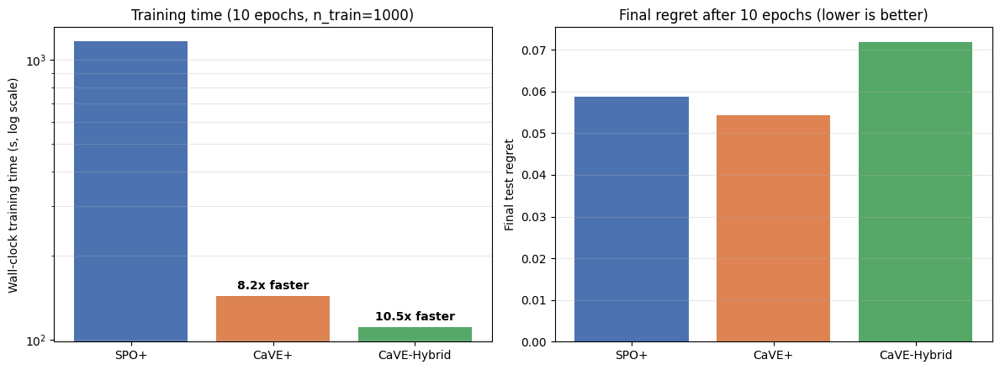

CaVE
++++

CaVE is a training loss for binary linear programs. It uses the binding
constraints at the true optimum as supervision for the predicted cost vector.
``optDatasetConstrs`` prepares these labels, and the ``CaVE`` loss consumes
them during training.

What CaVE Uses
==============

For a linear minimization problem, a binary solution remains optimal when the
negative predicted cost lies in the cone generated by the binding-constraint
normals at that solution. CaVE uses this condition directly:

.. code-block:: text

   true cost c
       -> true optimal solution w*
       -> binding constraints at w*
       -> cone of binding-constraint normals
       -> CaVE loss for predicted cost c_hat

The dataset stores the cone information. During training, ``CaVE`` projects the
sense-flipped predicted cost onto that cone and penalizes the angle between the
prediction and the projection.

Minimal Example
===============

CaVE uses ``pyepo.data.dataset.optDatasetConstrs`` instead of ``optDataset``.
It adds ``tight_ctrs``, the binding-constraint normals at the true optimum,
to the usual ``(x, c, w, z)`` batch.

The number of binding constraints can differ across instances, so the batch
needs padding. ``optDataLoader`` applies the padding automatically. An existing
``DataLoader`` can instead pass ``collate_fn=collate_tight_constraints``:

.. code-block:: python

   import pyepo
   import torch
   from torch import nn
   from pyepo.data.dataset import optDatasetConstrs, optDataLoader

   # TSP model; Gurobi backend required for binding-constraint extraction
   optmodel = pyepo.model.tspModel(num_nodes=10, formulation="DFJ")

   # synthetic TSP data
   feat, costs = pyepo.data.tsp.genData(
       num_data=1000,
       num_features=5,
       num_nodes=10,
       deg=4,
       noise_width=0.5,
       seed=135,
   )

   # CaVE dataset and padded batches
   dataset_constr = optDatasetConstrs(optmodel, feat, costs)
   dataloader_constr = optDataLoader(dataset_constr, batch_size=32, shuffle=True)

   # linear predictor and CaVE loss
   predmodel = nn.Linear(5, optmodel.num_cost)
   cave = pyepo.func.CaVE(optmodel, processes=2)
   optimizer = torch.optim.Adam(predmodel.parameters(), lr=1e-3)

   for x, c, w, z, tight_ctrs in dataloader_constr:
       cp = predmodel(x)
       loss = cave(cp, tight_ctrs)
       optimizer.zero_grad()
       loss.backward()
       optimizer.step()

Solver Requirements
===================

CaVE currently targets binary linear programs. Extracting binding-constraint
normals requires a Gurobi-backed ``optModel``. ``optDatasetConstrs`` raises on
infeasible instances or non-binary optima. Pass ``skip_infeas=True`` to drop
such instances instead.

Clarabel is used internally by the ``CaVE`` loss for the cone projection during
training. ``max_iter`` caps the Clarabel iterations. The default ``max_iter=3``
is the paper's **CaVE+** preset, which under-converges the projection on
purpose so it stays interior to the cone. Raising it changes the loss, not
just its precision. Setting ``solve_ratio < 1`` enables the **CaVE-Hybrid**
update, which uses the QP projection only for a fraction of batches and a
blended update for the remaining batches.

Performance Example
===================

   CVRP-20 results from notebook 04: ``num_data=1000``, 10 epochs, single process.
   In this setup, CaVE+ trains 8.2x faster than SPO+. CaVE-Hybrid with
   ``solve_ratio=0.3`` trains 10.5x faster than SPO+, with a final regret higher
   than both.

Related Pages
=============

* :doc:`../getting_started/data` documents ``optDatasetConstrs``.
* :doc:`../getting_started/function` documents the ``CaVE`` loss and training-loop pattern.
* :doc:`../notebooks` links to the CaVE Colab walkthrough.
