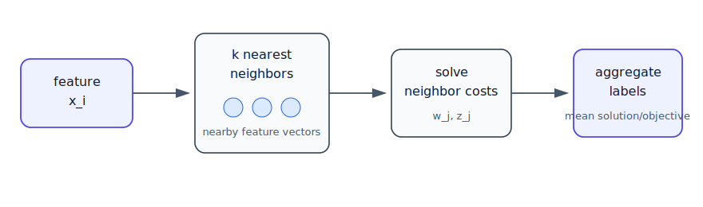

kNN Robust Losses
+++++++++++++++++

The kNN robust loss makes the training labels more robust to noise. For each
instance it mixes the cost vector with the costs of its nearest neighbors in
feature space and re-solves on the mixed costs, so the stored solution and
objective labels are local averages rather than single-instance values.

What Changes
============

The usual ``optDataset`` stores one optimal solution and objective value for
each instance. ``optDatasetKNN`` instead computes neighborhood labels:

This setting applies when nearby feature vectors are expected to have similar
decisions, but individual labels may be noisy.

Minimal Example
===============

Use ``pyepo.data.dataset.optDatasetKNN`` in place of ``optDataset``:

.. code-block:: python

   import pyepo
   import torch
   from torch import nn
   from torch.utils.data import DataLoader

   optmodel = pyepo.model.shortestPathModel((5, 5))
   feat, costs = pyepo.data.shortestpath.genData(
       num_data=1000,
       num_features=5,
       grid=(5, 5),
       deg=4,
       noise_width=0.5,
       seed=135,
   )

   dataset = pyepo.data.dataset.optDatasetKNN(optmodel, feat, costs, k=10, weight=0.5)
   dataloader = DataLoader(dataset, batch_size=32, shuffle=True)

   predmodel = nn.Linear(5, optmodel.num_cost)
   spo = pyepo.func.SPOPlus(optmodel, processes=2)
   optimizer = torch.optim.Adam(predmodel.parameters(), lr=1e-3)

   for x, c, w, z in dataloader:
       cp = predmodel(x)
       loss = spo(cp, c, w, z)
       optimizer.zero_grad()
       loss.backward()
       optimizer.step()

Parameters
==========

* ``k`` sets the number of neighbors used for each aggregate label.
* ``weight`` is the self-weight in the mix: ``weight=1`` keeps the original cost
  (no smoothing), and smaller values pull the cost toward the neighbors.

The batch format is the same as ``optDataset``: ``(x, c, w, z)``. Methods that
already consume ``optDataset`` batches can consume ``optDatasetKNN`` batches
without changing the training loop.

Related Pages
=============

* :doc:`../getting_started/data` explains ``optDatasetKNN``.
* :doc:`../getting_started/function` covers the training methods that consume the dataset.
* :doc:`../notebooks` links to the kNN robust-loss Colab walkthrough.
