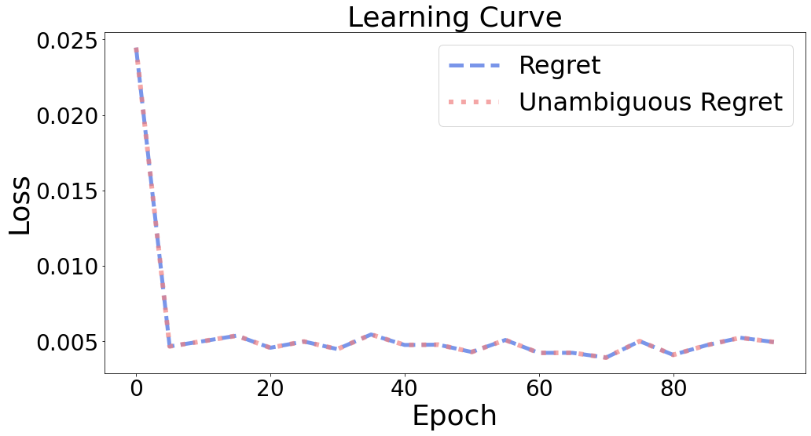

Evaluation
++++++++++

Regret
======

``pyepo.metric`` is to evaluate model performance. Regret :math:`l_{Regret}(\hat{\mathbf{c}}, \mathbf{c}) = \mathbf{c}^T \mathbf{w}^*(\hat{\mathbf{c}}) - z^*(\mathbf{c})` aims to measure the error in decision-making. It evaluates the distance between the objective value of the solution from predicted cost :math:`\hat{c}` and the true optimal objective value :math:`z^*(c)`.

.. autofunction:: pyepo.metric.regret
    :noindex:

.. code-block:: python

   import pyepo

   regret = pyepo.metric.regret(predmodel, optmodel, testloader)

Unambiguous Regret
==================

Given a cost vector :math:`\hat{c}`, there may be multiple optimal solutions of :math:`\underset{\mathbf{w} \in S}{\min}\;\hat{\mathbf{c}}^T \mathbf{w}`. Unambiguous Regret Loss :math:`l_{URegret}(\hat{\mathbf{c}}, \mathbf{c}) = \underset{\mathbf{w} \in W^*(\mathbf{c})}{\max} \mathbf{w}^T \mathbf{c} - z^*(\mathbf{c})` considers the worst cases.

However, as figure shows, the regret and the unambiguous regret are almost same in all training procedures. Therefore, although the unambiguous regret is more theoretically rigorous, it is not necessary to consider it in practice.

.. autofunction:: pyepo.metric.unambRegret
    :noindex:

.. code-block:: python

   import pyepo

   regret = pyepo.metric.unambRegret(predmodel, optmodel, testloader)
