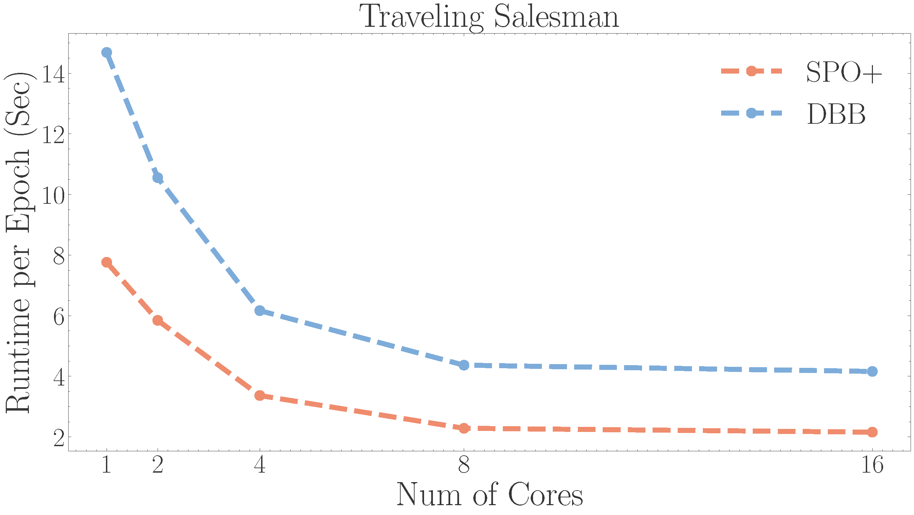

Auto Grad Functions
+++++++++++++++++++

Smart Predict-then-Optimize Loss+ (SPO+)
========================================

SPO+ Loss function [#f1]_ is a surrogate loss function of SPO Loss (Regret), which measures the decision error of optimization problem. For SPO/SPO+ Loss, the objective function is linear and constraints are known and fixed, but the cost vector need to be predicted from contextual data. The SPO+ Loss is convex with non-zero subgradient.

.. autoclass:: pyepo.func.SPOPlus
    :noindex:
    :members:

``pyepo.func.SPOPlus`` supports to solve optimization problems in parallel, parameter ``processes`` is the number of processors, **0 for using all available cores**.

.. code-block:: python

   import pyepo

   spo = pyepo.func.SPOPlus(optmodel, processes=2)

Differentiable Black-box Optimizer (DBB)
========================================

Diffenretiable black-box (DBB) optimizer function [#f2]_ estimates gradients from interpolation, replacing the zero gradients. For differentiable block-box, the objective function is linear and constraints are known and fixed, but the cost vector need to be predicted from contextual data.

.. autoclass:: pyepo.func.blackboxOpt
    :noindex:
    :members:

``pyepo.func.blackboxOpt`` supports to solve optimization problems in parallel, parameter ``processes`` is the number of processors, 0 for using all available cores. ``lambd`` is a hyperparameter for function smoothing. The range of ``lambd`` should be **10** to **20**.

.. code-block:: python

   import pyepo

   dbb = pyepo.func.blackboxOpt(optmodel, lambd=10, processes=2)

Negative Identity Backpropagation (NID)
========================================

Negative Identity Backpropagation (NID) [#f6]_ treats the solver as a negative identity mapping during the backward pass, which is equivalent to DBB with certain hyperparameter. It is hyperparameter-free and does not require any additional computationally expensive call to the solver on the backward pass.

.. autoclass:: pyepo.func.negativeIdentity
    :noindex:
    :members:

``pyepo.func.negativeIdentity`` supports to solve optimization problems in parallel, parameter ``processes`` is the number of processors, 0 for using all available cores.

.. code-block:: python

   import pyepo

   nid = pyepo.func.negativeIdentity(optmodel, processes=2)

Differentiable Perturbed Optimizer (DPO)
========================================

Differentiable perturbed Optimizer (DPO) [#f3]_ uses Monte-Carlo samples to estimate solutions, in which randomly perturbed costs are sampled to optimize. For the perturbed optimizer, the cost vector needs to be predicted from contextual data and are perturbed with Gaussian noise. The perturbed optimizer is differentiable in its inputs with non-zero Jacobian.

.. autoclass:: pyepo.func.perturbedOpt
    :noindex:
    :members:

``pyepo.func.perturbedOpt`` supports to solve optimization problems in parallel, parameter ``processes`` is the number of processors, 0 for using all available cores. ``n_samples`` is the number of Monte-Carlo samples to estimate solutions, and ``sigma`` is the variance of Gaussian noise perturbation.

.. code-block:: python

   import pyepo

   dpo = pyepo.func.perturbedOpt(optmodel, n_samples=10, sigma=0.5, processes=2)

Perturbed Fenchel-Young Loss (PYFL)
===================================

Perturbed Fenchel-Young loss (PYFL) function [#f3]_ uses perturbation techniques with Monte-Carlo samples. The use of the loss improves the algorithmic by the specific expression of the gradients of the loss. For the perturbed optimizer, the cost vector need to be predicted from contextual data and are perturbed with Gaussian noise. The Fenchel-Young loss allows to directly optimize a loss between the features and solutions with less computation.

.. autoclass:: pyepo.func.perturbedFenchelYoung
    :noindex:
    :members:

``pyepo.func.perturbedFenchelYoung`` supports to solve optimization problems in parallel, parameter ``processes`` is the number of processors, 0 for using all available cores. ``n_samples`` is the number of Monte-Carlo samples to estimate solutions, and ``sigma`` is the variance of Gaussian noise perturbation.

.. code-block:: python

   import pyepo

   pfy = pyepo.func.perturbedFenchelYoung(optmodel, n_samples=10, sigma=0.5, processes=2)

Implicit Maximum Likelihood Estimator (I-MLE)
=============================================

Implicit Maximum Likelihood Estimator (I-MLE) [#f7]_ use the perturb-and-MAP framework. They sample noise from a Sum-of-Gamma distribution and interpolate the loss function to approximate finite difference.

.. autoclass:: pyepo.func.implicitMLE
    :noindex:
    :members:

``pyepo.func.implicitMLE`` supports to solve optimization problems in parallel, parameter ``processes`` is the number of processors, 0 for using all available cores.

.. code-block:: python

   import pyepo

   imle = pyepo.func.implicitMLE(optmodel, n_samples=10, sigma=1.0, lambd=10, processes=2)

Adaptive Implicit Maximum Likelihood Estimator (AI-MLE)
=======================================================

Adaptive Implicit Maximum Likelihood Estimator (AI-MLE) [#f8]_ use the adaptive interpolation step and the perturb-and-MAP framework. They sample noise from a Sum-of-Gamma distribution and interpolate the loss function to approximate finite difference.

.. autoclass:: pyepo.func.adaptiveImplicitMLE
    :noindex:
    :members:

``pyepo.func.adaptiveImplicitMLE`` supports to solve optimization problems in parallel, parameter ``processes`` is the number of processors, 0 for using all available cores.

.. code-block:: python

   import pyepo

   aimle = pyepo.func.implicitMLE(optmodel, n_samples=10, sigma=1.0, processes=2)

Noise Contrastive Estimation (NCE)
==================================

Noise Contrastive Estimation (NCE) [#f4]_ serve as surrogate loss function based on negative examples. The key idea is to work with a small set of non-optimal solutions as negative samples. Thus, we can maximizes the difference  of the probability between optimal solution and others.

.. autoclass:: pyepo.func.NCE
    :noindex:
    :members:

``pyepo.func.NCE`` supports to solve optimization problems in parallel, parameter ``processes`` is the number of processors, **0 for using all available cores**.

.. code-block:: python

   import pyepo

   nce = pyepo.func.NCE(optmodel, processes=2, solve_ratio=0.05, dataset=dataset_train)

Contrastive Maximum A Posterior Estimation (CMAP)
=================================================

Contrastive Maximum A Posteriori (CMAP) Loss function [#f4]_ is a special case of NCE where only samples the best one. It is simple but efficient.

.. autoclass:: pyepo.func.contrastiveMAP
    :noindex:
    :members:

``pyepo.func.contrastiveMAP`` supports to solve optimization problems in parallel, parameter ``processes`` is the number of processors, **0 for using all available cores**.

.. code-block:: python

   import pyepo

   cmap = pyepo.func.contrastiveMAP(optmodel, processes=2, solve_ratio=0.05, dataset=dataset_train)

Learning to Rank (LTR)
======================

LTR Loss function [#f5]_ is to learn an objective function that ranks a pool of feasible solutions correctly. LTR methods assign scores to the disparate solutions in pool, then establish surrogate loss functions predicated on these scores with the intention of ranking the optimal solution best.

Pointwise loss calculates the ranking scores of the items.

.. autoclass:: pyepo.func.pointwiseLTR
    :noindex:
    :members:

Pairwise loss learns the relative ordering of pairs of items.

.. autoclass:: pyepo.func.pairwiseLTR
    :noindex:
    :members:

Listwise loss measures the scores of the whole ranked lists.

.. autoclass:: pyepo.func.listwiseLTR
    :noindex:
    :members:

``pyepo.func.pointwiseLTR``, ``pyepo.func.pairwiseLTR``, and ``pyepo.func.listwiseLTR`` supports to solve optimization problems in parallel, parameter ``processes`` is the number of processors, **0 for using all available cores**.

.. code-block:: python

   import pyepo

   # pointwise
   ltr = pyepo.func.pointwiseLTR(optmodel, processes=2, solve_ratio=0.05, dataset=dataset_train)
   # pairwise
   ltr = pyepo.func.pairwiseLTR(optmodel, processes=2, solve_ratio=0.05, dataset=dataset_train)
   # listwise
   ltr = pyepo.func.listwiseLTR(optmodel, processes=2, solve_ratio=0.05, dataset=dataset_train)

Parallel Computation
====================

``PyEPO`` supports parallel computation for solving optimization problems in training, where the parameter ``processes`` is the number of processors to be used.

The figure shows that the increasing of processes reduces the runtime.

.. rubric:: Footnotes

.. [#f1] Elmachtoub, A. N., & Grigas, P. (2021). Smart “predict, then optimize”. Management Science.
.. [#f2] Vlastelica, M., Paulus, A., Musil, V., Martius, G., & Rolínek, M. (2019). Differentiation of blackbox combinatorial solvers. arXiv preprint arXiv:1912.02175.
.. [#f3] Berthet, Q., Blondel, M., Teboul, O., Cuturi, M., Vert, J. P., & Bach, F. (2020). Learning with differentiable perturbed optimizers. Advances in neural information processing systems, 33, 9508-9519.
.. [#f4] Mulamba, M., Mandi, J., Diligenti, M., Lombardi, M., Bucarey, V., & Guns, T. (2021). Contrastive losses and solution caching for predict-and-optimize. Proceedings of the Thirtieth International Joint Conference on Artificial Intelligence.
.. [#f5] Mandi, J., Bucarey, V., Mulamba, M., & Guns, T. (2022). Decision-focused learning: through the lens of learning to rank. Proceedings of the 39th International Conference on Machine Learning.
.. [#f6] Sahoo, S. S., Paulus, A., Vlastelica, M., Musil, V., Kuleshov, V., & Martius, G. (2022). Backpropagation through combinatorial algorithms: Identity with projection works. arXiv preprint arXiv:2205.15213.
.. [#f7] Niepert, M., Minervini, P., & Franceschi, L. (2021). Implicit MLE: backpropagating through discrete exponential family distributions. Advances in Neural Information Processing Systems, 34, 14567-14579.
.. [#f8] Minervini, P., Franceschi, L., & Niepert, M. (2023, June). Adaptive perturbation-based gradient estimation for discrete latent variable models. In Proceedings of the AAAI Conference on Artificial Intelligence (Vol. 37, No. 8, pp. 9200-9208).
