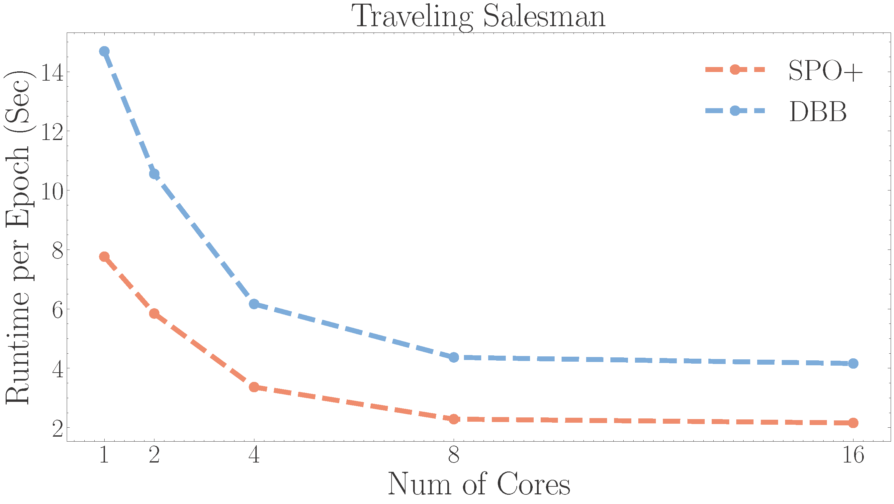

Auto Grad Functions
+++++++++++++++++++

Choosing a Training Module
==========================

The modules differ mainly in what they return and what supervision they use:

.. list-table::
   :header-rows: 1
   :widths: 18 28 28 26

   * - Module
     - Returns
     - Typical supervision
     - When to use
   * - ``SPOPlus``
     - loss
     - true costs, true optimal solutions, true objective values
     - strong default for linear objectives
   * - ``blackboxOpt`` / ``negativeIdentity``
     - predicted solutions
     - task loss chosen by the user
     - direct solution-level or objective-level losses
   * - ``perturbedOpt`` / ``perturbedOptMul``
     - expected perturbed solutions
     - task loss chosen by the user
     - DPO; use the multiplicative variant for sign-sensitive oracles
   * - ``perturbedFenchelYoung`` / ``perturbedFenchelYoungMul``
     - loss
     - true optimal solutions
     - PFYL; use the multiplicative variant for sign-sensitive oracles
   * - ``NCE`` / ``contrastiveMAP``
     - loss
     - true optimal solutions and a solution pool
     - contrastive training with cached negative solutions
   * - ``pointwiseLTR`` / ``pairwiseLTR`` / ``listwiseLTR``
     - loss
     - true costs and a solution pool
     - learning-to-rank formulations over feasible solutions

Smart Predict-then-Optimize Loss+ (SPO+)
=========================================

SPO+ [#f1]_ is a convex surrogate loss function for SPO Loss (Regret), which measures the decision error of an optimization problem. The objective function is linear with known, fixed constraints, and the cost vector is predicted from contextual data.

.. autoclass:: pyepo.func.SPOPlus
    :noindex:
    :members:

``pyepo.func.SPOPlus`` supports parallel computation. The ``processes`` parameter sets the number of processors (**0 uses all available cores**).

.. code-block:: python

   import pyepo

   spo = pyepo.func.SPOPlus(optmodel, processes=2)

Differentiable Black-box Optimizer (DBB)
========================================

DBB [#f3]_ estimates gradients via interpolation, replacing the zero gradients of the linear program solver. The objective function is linear with known, fixed constraints, and the cost vector is predicted from contextual data.

.. autoclass:: pyepo.func.blackboxOpt
    :noindex:
    :members:

``pyepo.func.blackboxOpt`` supports parallel computation. ``lambd`` is a smoothing hyperparameter (recommended range: **10** to **20**).

.. code-block:: python

   import pyepo

   dbb = pyepo.func.blackboxOpt(optmodel, lambd=10, processes=2)

Negative Identity Backpropagation (NID)
========================================

NID [#f4]_ treats the solver as a negative identity mapping during backpropagation. This is equivalent to DBB with a specific hyperparameter setting. NID is hyperparameter-free and requires no additional solver calls during the backward pass.

.. autoclass:: pyepo.func.negativeIdentity
    :noindex:
    :members:

``pyepo.func.negativeIdentity`` supports parallel computation.

.. code-block:: python

   import pyepo

   nid = pyepo.func.negativeIdentity(optmodel, processes=2)

Differentiable Perturbed Optimizer (DPO)
========================================

DPO [#f5]_ uses Monte Carlo sampling to estimate solutions by optimizing randomly perturbed costs. Its custom backward pass provides a gradient estimator for end-to-end training. ``perturbedOpt`` is the additive Gaussian version, and ``perturbedOptMul`` is the multiplicative version for sign-sensitive oracles [#f6]_. The multiplicative variant assumes predicted costs already have the intended nonzero sign; for nonnegative-cost problems, use a positive-output predictor such as Softplus plus a small epsilon.

.. autoclass:: pyepo.func.perturbedOpt
    :noindex:
    :members:

.. autoclass:: pyepo.func.perturbedOptMul
    :noindex:
    :members:

Both DPO variants support parallel computation. ``n_samples`` is the number of Monte Carlo samples, and ``sigma`` controls the perturbation amplitude.

.. code-block:: python

   import pyepo

   # additive DPO
   dpo = pyepo.func.perturbedOpt(optmodel, n_samples=10, sigma=0.5, processes=2)
   # multiplicative DPO
   dpo_mul = pyepo.func.perturbedOptMul(optmodel, n_samples=10, sigma=0.5, processes=2)

Perturbed Fenchel-Young Loss (PFYL)
====================================

PFYL [#f5]_ uses perturbation techniques with Monte Carlo sampling. By exploiting the specific gradient structure of the Fenchel-Young loss, it directly compares the expected perturbed solution with the true optimal solution and avoids the extra task loss needed by DPO. ``perturbedFenchelYoung`` is the additive Gaussian version, and ``perturbedFenchelYoungMul`` is the multiplicative PFYL version for sign-sensitive oracles [#f6]_. The multiplicative variant has the same sign assumption as ``perturbedOptMul``.

.. autoclass:: pyepo.func.perturbedFenchelYoung
    :noindex:
    :members:

.. autoclass:: pyepo.func.perturbedFenchelYoungMul
    :noindex:
    :members:

Both PFYL variants support parallel computation. ``n_samples`` is the number of Monte Carlo samples, and ``sigma`` controls the perturbation amplitude.

.. code-block:: python

   import pyepo

   # additive PFYL
   pfy = pyepo.func.perturbedFenchelYoung(optmodel, n_samples=10, sigma=0.5, processes=2)
   # multiplicative PFYL
   pfy_mul = pyepo.func.perturbedFenchelYoungMul(optmodel, n_samples=10, sigma=0.5, processes=2)

Noise Contrastive Estimation (NCE)
===================================

NCE [#f7]_ is a surrogate loss based on negative examples. It uses a small set of non-optimal solutions as negative samples to maximize the probability gap between the optimal solution and the rest.

.. autoclass:: pyepo.func.NCE
    :noindex:
    :members:

``pyepo.func.NCE`` supports parallel computation (**0 uses all available cores**).

.. code-block:: python

   import pyepo

   nce = pyepo.func.NCE(optmodel, processes=2, solve_ratio=0.05, dataset=dataset)

Contrastive MAP (CMAP)
======================

CMAP [#f7]_ is a special case of NCE that uses only the single best negative sample. It is simpler and often equally effective.

.. autoclass:: pyepo.func.contrastiveMAP
    :noindex:
    :members:

``pyepo.func.contrastiveMAP`` supports parallel computation (**0 uses all available cores**).

.. code-block:: python

   import pyepo

   cmap = pyepo.func.contrastiveMAP(optmodel, processes=2, solve_ratio=0.05, dataset=dataset)

Learning to Rank (LTR)
=======================

LTR [#f8]_ learns an objective function that correctly ranks a pool of feasible solutions. LTR methods assign scores to solutions and define surrogate losses that encourage ranking the optimal solution highest.

**Pointwise** loss computes ranking scores for individual solutions.

.. autoclass:: pyepo.func.pointwiseLTR
    :noindex:
    :members:

**Pairwise** loss learns the relative ordering between pairs of solutions.

.. autoclass:: pyepo.func.pairwiseLTR
    :noindex:
    :members:

**Listwise** loss evaluates scores over the entire ranked list.

.. autoclass:: pyepo.func.listwiseLTR
    :noindex:
    :members:

All three variants support parallel computation (**0 uses all available cores**).

.. code-block:: python

   import pyepo

   # pointwise
   ltr = pyepo.func.pointwiseLTR(optmodel, processes=2, solve_ratio=0.05, dataset=dataset)
   # pairwise
   ltr = pyepo.func.pairwiseLTR(optmodel, processes=2, solve_ratio=0.05, dataset=dataset)
   # listwise
   ltr = pyepo.func.listwiseLTR(optmodel, processes=2, solve_ratio=0.05, dataset=dataset)

Implicit Maximum Likelihood Estimator (I-MLE)
==============================================

I-MLE [#f9]_ uses the perturb-and-MAP framework, sampling noise from a Sum-of-Gamma distribution and interpolating the loss function to approximate finite differences.

.. autoclass:: pyepo.func.implicitMLE
    :noindex:
    :members:

``pyepo.func.implicitMLE`` supports parallel computation.

.. code-block:: python

   import pyepo

   imle = pyepo.func.implicitMLE(optmodel, n_samples=10, sigma=1.0, lambd=10, processes=2)

Adaptive Implicit Maximum Likelihood Estimator (AI-MLE)
========================================================

AI-MLE [#f10]_ extends I-MLE with an adaptive interpolation step within the perturb-and-MAP framework, sampling noise from a Sum-of-Gamma distribution.

.. autoclass:: pyepo.func.adaptiveImplicitMLE
    :noindex:
    :members:

``pyepo.func.adaptiveImplicitMLE`` supports parallel computation.

.. code-block:: python

   import pyepo

   aimle = pyepo.func.adaptiveImplicitMLE(optmodel, n_samples=10, sigma=1.0, processes=2)

Perturbation Gradient (PG)
==========================

PG [#f11]_ is a surrogate loss based on zeroth-order gradient approximation via Danskin's Theorem. It uses finite differences along the true cost direction to estimate informative gradients through the optimization solver.

.. autoclass:: pyepo.func.perturbationGradient
    :noindex:
    :members:

``pyepo.func.perturbationGradient`` supports parallel computation (**0 uses all available cores**). ``sigma`` controls the finite difference width. ``two_sides`` enables central differencing for more accurate gradient estimates.

.. code-block:: python

   import pyepo

   pg = pyepo.func.perturbationGradient(optmodel, sigma=0.1, two_sides=False, processes=2)

Parallel Computation
====================

All ``pyepo.func`` modules support parallel solving during training via the ``processes`` parameter.

The figure shows that increasing the number of processes reduces runtime.

.. rubric:: Footnotes

.. [#f1] Elmachtoub, A. N., & Grigas, P. (2021). Smart "predict, then optimize". Management Science.
.. [#f3] Vlastelica, M., Paulus, A., Musil, V., Martius, G., & Rolinek, M. (2019). Differentiation of blackbox combinatorial solvers. arXiv preprint arXiv:1912.02175.
.. [#f4] Sahoo, S. S., Paulus, A., Vlastelica, M., Musil, V., Kuleshov, V., & Martius, G. (2022). Backpropagation through combinatorial algorithms: Identity with projection works. arXiv preprint arXiv:2205.15213.
.. [#f5] Berthet, Q., Blondel, M., Teboul, O., Cuturi, M., Vert, J. P., & Bach, F. (2020). Learning with differentiable perturbed optimizers. Advances in Neural Information Processing Systems, 33, 9508-9519.
.. [#f6] Dalle, G., Baty, L., Bouvier, L., & Parmentier, A. (2022). Learning with Combinatorial Optimization Layers: a Probabilistic Approach. arXiv preprint arXiv:2207.13513.
.. [#f7] Mulamba, M., Mandi, J., Diligenti, M., Lombardi, M., Bucarey, V., & Guns, T. (2021). Contrastive losses and solution caching for predict-and-optimize. Proceedings of the Thirtieth International Joint Conference on Artificial Intelligence.
.. [#f8] Mandi, J., Bucarey, V., Mulamba, M., & Guns, T. (2022). Decision-focused learning: through the lens of learning to rank. Proceedings of the 39th International Conference on Machine Learning.
.. [#f9] Niepert, M., Minervini, P., & Franceschi, L. (2021). Implicit MLE: backpropagating through discrete exponential family distributions. Advances in Neural Information Processing Systems, 34, 14567-14579.
.. [#f10] Minervini, P., Franceschi, L., & Niepert, M. (2023). Adaptive perturbation-based gradient estimation for discrete latent variable models. Proceedings of the AAAI Conference on Artificial Intelligence.
.. [#f11] Gupta, V., & Huang, M. (2024). Decision-Focused Learning with Directional Gradients. arXiv preprint arXiv:2402.03256.
