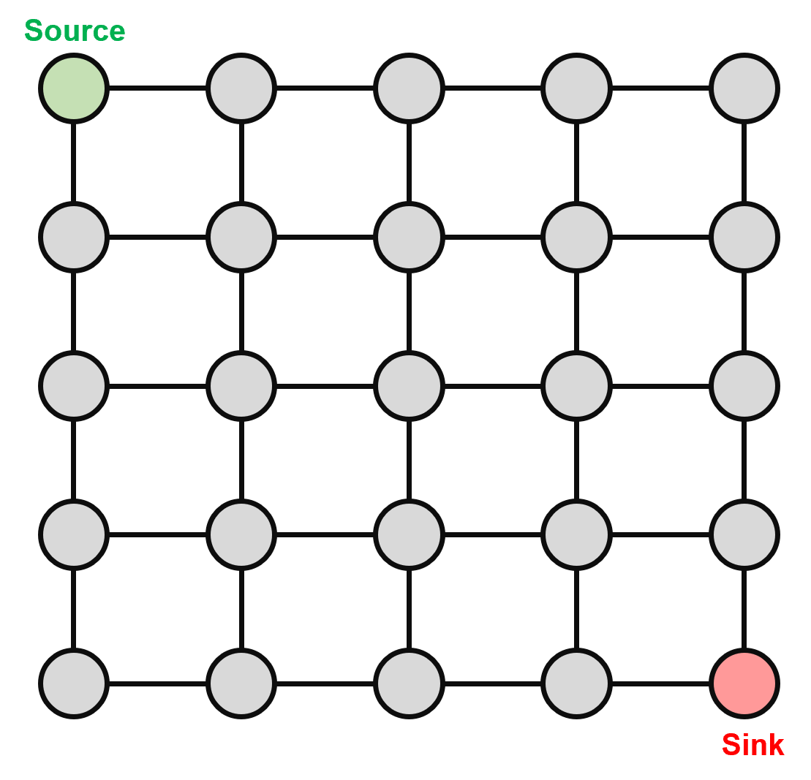

Model
+++++

``PyEPO`` supports end-to-end predict-then-optimize with linear objective functions and unknown cost coefficients. At its core is the differentiable optimization solver, which computes gradients of the loss with respect to the cost coefficients.

``optModel`` is the base abstraction in ``PyEPO``. It wraps an optimization solver or algorithm with a unified interface for training and evaluation. ``PyEPO`` provides several pre-defined models using GurobiPy, COPT, Pyomo, OR-Tools, and MPAX:

* **Shortest path** (GurobiPy, COPT, Pyomo, OR-Tools & MPAX)
* **Knapsack** (GurobiPy, COPT, Pyomo, OR-Tools & MPAX)
* **Traveling salesperson** (GurobiPy, COPT & Pyomo)
* **Capacitated vehicle routing** (GurobiPy, COPT & Pyomo)
* **Portfolio optimization** (GurobiPy, COPT & Pyomo)

When building models with ``PyEPO``, users do **not** need to specify the cost coefficients -- they are predicted from data at training time.

For more details, see the `01 Optimization Model <https://colab.research.google.com/github/khalil-research/PyEPO/blob/main/notebooks/01%20Optimization%20Model.ipynb>`_ notebook.

User-Defined Models
===================

Users can define custom optimization problems with linear objective functions. ``PyEPO`` provides several ways to do this:

1. **GurobiPy-based**: Inherit from ``optGrbModel`` and implement ``_getModel``.
2. **COPT-based**: Inherit from ``optCoptModel`` and implement ``_getModel``.
3. **Pyomo-based**: Inherit from ``optOmoModel`` and implement ``_getModel``.
4. **OR-Tools-based**: Inherit from ``optOrtModel`` (pywraplp) or ``optOrtCpModel`` (CP-SAT) and implement ``_getModel``.
5. **MPAX-based**: Inherit from ``optMpaxModel`` and implement ``_getModel`` to populate constraint matrices ``self.A``, ``self.b``, ``self.G``, ``self.h``, ``self.l``, ``self.u``.
6. **From scratch**: Inherit from ``optModel`` and implement ``_getModel``, ``setObj``, ``solve``, and ``num_cost``.

The ``optModel`` interface consists of:

* ``_getModel``: Build and return the optimization model and decision variables.
* ``setObj``: Set the objective function with a given cost vector.
* ``solve``: Solve the problem and return the optimal solution and objective value.
* ``num_cost``: Number of cost coefficients (length of the cost vector).

User-Defined GurobiPy Models
----------------------------

To define a GurobiPy model, inherit from ``pyepo.model.grb.optGrbModel`` and implement the ``_getModel`` method. The model sense (minimize/maximize) is automatically detected from the GurobiPy model.

.. autoclass:: pyepo.model.grb.optGrbModel
    :noindex:
    :members: __init__, _getModel, setObj, solve, num_cost, relax

For example, consider the following binary optimization problem:

.. math::
  \begin{aligned}
  \max_{x} & \sum_{i=0}^4 c_i x_i \\
  s.t. \quad & 3 x_0 + 4 x_1 + 3 x_2 + 6 x_3 + 4 x_4 \leq 12 \\
  & 4 x_0 + 5 x_1 + 2 x_2 + 3 x_3 + 5 x_4 \leq 10 \\
  & 5 x_0 + 4 x_1 + 6 x_2 + 2 x_3 + 3 x_4 \leq 15 \\
  & \forall x_i \in \{0, 1\}
  \end{aligned}

Users only need to implement the ``_getModel`` method:

.. code-block:: python

   import random

   import gurobipy as gp
   from gurobipy import GRB

   from pyepo.model.grb import optGrbModel

   class myModel(optGrbModel):

       def _getModel(self):
           # create a model
           m = gp.Model()
           # variables
           x = m.addVars(5, name="x", vtype=GRB.BINARY)
           # model sense
           m.modelSense = GRB.MAXIMIZE
           # constraints
           m.addConstr(3 * x[0] + 4 * x[1] + 3 * x[2] + 6 * x[3] + 4 * x[4] <= 12)
           m.addConstr(4 * x[0] + 5 * x[1] + 2 * x[2] + 3 * x[3] + 5 * x[4] <= 10)
           m.addConstr(5 * x[0] + 4 * x[1] + 6 * x[2] + 2 * x[3] + 3 * x[4] <= 15)
           return m, x

   myoptmodel = myModel()
   cost = [random.random() for _ in range(myoptmodel.num_cost)] # random cost vector
   myoptmodel.setObj(cost) # set objective function
   myoptmodel.solve() # solve

User-Defined COPT Models
-------------------------

To define a COPT model, inherit from ``pyepo.model.copt.optCoptModel`` and implement the ``_getModel`` method. The model sense (minimize/maximize) is automatically detected from the COPT model.

.. autoclass:: pyepo.model.copt.optCoptModel
    :noindex:
    :members: __init__, _getModel, setObj, solve, num_cost

Here is the same problem implemented with COPT:

.. code-block:: python

   import random

   from coptpy import Envr, COPT

   from pyepo.model.copt import optCoptModel

   class myModel(optCoptModel):

       def _getModel(self):
           # create a model
           m = Envr().createModel()
           # variables
           x = m.addVars(range(5), vtype=COPT.BINARY)
           # model sense
           m.setObjSense(COPT.MAXIMIZE)
           # constraints
           m.addConstr(3 * x[0] + 4 * x[1] + 3 * x[2] + 6 * x[3] + 4 * x[4] <= 12)
           m.addConstr(4 * x[0] + 5 * x[1] + 2 * x[2] + 3 * x[3] + 5 * x[4] <= 10)
           m.addConstr(5 * x[0] + 4 * x[1] + 6 * x[2] + 2 * x[3] + 3 * x[4] <= 15)
           return m, x

   myoptmodel = myModel()
   cost = [random.random() for _ in range(myoptmodel.num_cost)] # random cost vector
   myoptmodel.setObj(cost) # set objective function
   myoptmodel.solve() # solve

User-Defined Pyomo Models
-------------------------

To define a Pyomo model, inherit from ``pyepo.model.omo.optOmoModel`` and implement the ``_getModel`` method.

.. autoclass:: pyepo.model.omo.optOmoModel
    :noindex:
    :members: __init__, _getModel, setObj, solve, num_cost, relax

.. warning::  Unlike ``optGrbModel``, ``optOmoModel`` requires explicitly setting ``modelSense`` in ``_getModel``.

Here is the same problem implemented with Pyomo:

.. code-block:: python

   import random

   from pyomo import environ as pe

   from pyepo.model.omo import optOmoModel
   from pyepo import EPO

   class myModel(optOmoModel):

       def _getModel(self):
           # sense
           self.modelSense = EPO.MAXIMIZE
           # create a model
           m = pe.ConcreteModel()
           # variables
           x = pe.Var([0,1,2,3,4], domain=pe.Binary)
           m.x = x
           # constraints
           m.cons = pe.ConstraintList()
           m.cons.add(3 * x[0] + 4 * x[1] + 3 * x[2] + 6 * x[3] + 4 * x[4] <= 12)
           m.cons.add(4 * x[0] + 5 * x[1] + 2 * x[2] + 3 * x[3] + 5 * x[4] <= 10)
           m.cons.add(5 * x[0] + 4 * x[1] + 6 * x[2] + 2 * x[3] + 3 * x[4] <= 15)
           return m, x

   myoptmodel = myModel(solver="gurobi")
   cost = [random.random() for _ in range(myoptmodel.num_cost)] # random cost vector
   myoptmodel.setObj(cost) # set objective function
   myoptmodel.solve() # solve

User-Defined OR-Tools Models
-----------------------------

OR-Tools provides two solving paradigms: pywraplp (LP/MIP solvers) and CP-SAT (constraint programming). ``PyEPO`` provides base classes for both.

**pywraplp** -- Inherit from ``pyepo.model.ort.optOrtModel`` and implement ``_getModel``. The ``solver`` parameter selects the backend (e.g., ``"scip"``, ``"glop"``, ``"cbc"``).

.. autoclass:: pyepo.model.ort.optOrtModel
    :noindex:
    :members: __init__, _getModel, setObj, solve, num_cost

.. warning::  Unlike ``optGrbModel``, ``optOrtModel`` requires explicitly setting ``modelSense`` in ``_getModel``.

.. code-block:: python

   import random

   from ortools.linear_solver import pywraplp

   from pyepo.model.ort import optOrtModel
   from pyepo import EPO

   class myModel(optOrtModel):

       def _getModel(self):
           # sense
           self.modelSense = EPO.MAXIMIZE
           # create a model
           m = pywraplp.Solver.CreateSolver("SCIP")
           # variables
           x = {i: m.BoolVar(f"x_{i}") for i in range(5)}
           # constraints
           m.Add(3 * x[0] + 4 * x[1] + 3 * x[2] + 6 * x[3] + 4 * x[4] <= 12)
           m.Add(4 * x[0] + 5 * x[1] + 2 * x[2] + 3 * x[3] + 5 * x[4] <= 10)
           m.Add(5 * x[0] + 4 * x[1] + 6 * x[2] + 2 * x[3] + 3 * x[4] <= 15)
           return m, x

   myoptmodel = myModel(solver="scip")
   cost = [random.random() for _ in range(myoptmodel.num_cost)] # random cost vector
   myoptmodel.setObj(cost) # set objective function
   myoptmodel.solve() # solve

**CP-SAT** -- Inherit from ``pyepo.model.ort.optOrtCpModel`` and implement ``_getModel``. CP-SAT is an integer-only solver; float cost vectors are automatically scaled internally.

.. autoclass:: pyepo.model.ort.optOrtCpModel
    :noindex:
    :members: __init__, _getModel, setObj, solve, num_cost

.. code-block:: python

   from ortools.sat.python import cp_model

   from pyepo.model.ort import optOrtCpModel
   from pyepo import EPO

   class myCpModel(optOrtCpModel):

       def _getModel(self):
           # sense
           self.modelSense = EPO.MAXIMIZE
           # create a model
           m = cp_model.CpModel()
           # variables
           x = {i: m.NewBoolVar(f"x_{i}") for i in range(5)}
           # constraints (integer coefficients)
           m.Add(3 * x[0] + 4 * x[1] + 3 * x[2] + 6 * x[3] + 4 * x[4] <= 12)
           m.Add(4 * x[0] + 5 * x[1] + 2 * x[2] + 3 * x[3] + 5 * x[4] <= 10)
           m.Add(5 * x[0] + 4 * x[1] + 6 * x[2] + 2 * x[3] + 3 * x[4] <= 15)
           return m, x

   myoptmodel = myCpModel()

.. note::  CP-SAT does not support LP relaxation. Calling ``relax()`` will raise a ``RuntimeError``.

User-Defined MPAX Models
------------------------

MPAX (Mathematical Programming in JAX) is a hardware-accelerated mathematical programming framework based on the PDHG (Primal-Dual Hybrid Gradient) algorithm, designed for large-scale linear and quadratic programs.

For a runnable walkthrough that batch-solves LPs on GPU end-to-end with MPAX, see the `09 Solving on MPAX with PDHG <https://colab.research.google.com/github/khalil-research/PyEPO/blob/main/notebooks/09%20Solving%20on%20MPAX%20with%20PDHG.ipynb>`_ notebook.

To define an MPAX model, inherit from ``pyepo.model.mpax.optMpaxModel`` and populate the constraint matrices inside ``_getModel``:

   - ``self.A``, ``self.b``: Equality constraints :math:`Ax = b`. Use ``jnp.zeros((0, n))`` / ``jnp.zeros((0,))`` for none.
   - ``self.G``, ``self.h``: Inequality constraints :math:`Gx \geq h`. Use ``jnp.zeros((0, n))`` / ``jnp.zeros((0,))`` for none.
   - ``self.l``: Lower bounds (typically zeros for non-negative variables).
   - ``self.u``: Upper bounds (use ``jnp.full(n, jnp.inf)`` for unbounded).
   - ``self.Q`` *(optional)*: PSD quadratic-objective matrix for the QP path; default ``None`` keeps the LP path.

``_getModel`` returns ``(None, [])`` -- MPAX has no explicit model object; the matrices are the model. Additional knobs:

* **Sparse vs dense**: override the class attribute ``use_sparse_matrix`` (default ``True``).
* **Model sense**: set ``self.modelSense = EPO.MAXIMIZE`` in ``_getModel`` or ``__init__`` for a maximization problem; defaults to minimization.
* **LP vs QP**: leave ``self.Q = None`` (default) for an LP routed through ``create_lp``; assign a PSD matrix to switch to a convex QP with objective :math:`\tfrac{1}{2} x^\top Q x + c^\top x` routed through ``create_qp``. Constraints stay linear -- MPAX only supports a quadratic objective. ``MAXIMIZE`` with a PSD ``Q`` is non-convex and rejected at construction; reformulate as ``MINIMIZE`` of the negated objective.

.. autoclass:: pyepo.model.mpax.optMpaxModel
  :noindex:
  :members: __init__, _getModel, setObj, solve, num_cost

.. code-block:: python

   import jax.numpy as jnp

   from pyepo.model.mpax import optMpaxModel

   class myLpModel(optMpaxModel):

       use_sparse_matrix = False  # dense matrices

       def _getModel(self):
           n = 5  # number of variables
           # equality A x = b
           self.A = jnp.array([[1.0, 1.0, 1.0, 1.0, 1.0]])
           self.b = jnp.array([2.0])
           # inequality G x >= h
           self.G = jnp.array([[1.0, 0.0, 1.0, 0.0, 1.0]])
           self.h = jnp.array([1.0])
           # variable bounds x in [0, 1]
           self.l = jnp.zeros(n, dtype=jnp.float32)
           self.u = jnp.ones(n, dtype=jnp.float32)
           return None, []

   optmodel = myLpModel()
   cost = [0.1, 0.4, 0.2, 0.3, 0.5]
   optmodel.setObj(cost) # set objective function
   optmodel.solve() # solve

For a QP, additionally assign ``self.Q`` to a PSD matrix; the same ``setObj`` / ``solve`` / ``batch_optimize`` interface then minimizes :math:`\tfrac{1}{2} x^\top Q x + c^\top x`:

.. code-block:: python

   import jax.numpy as jnp

   from pyepo.model.mpax import optMpaxModel

   class myQpModel(optMpaxModel):

       use_sparse_matrix = False

       def _getModel(self):
           n = 4
           # no equality
           self.A = jnp.zeros((0, n), dtype=jnp.float32)
           self.b = jnp.zeros((0,), dtype=jnp.float32)
           # slack inequality so PDHG has a non-empty dual block
           self.G = jnp.ones((1, n), dtype=jnp.float32)
           self.h = jnp.array([-1000.0], dtype=jnp.float32)
           # box bounds
           self.l = jnp.full(n, -10.0, dtype=jnp.float32)
           self.u = jnp.full(n,  10.0, dtype=jnp.float32)
           # PSD quadratic objective -> routes to create_qp
           self.Q = jnp.diag(jnp.array([2.0, 4.0, 6.0, 8.0], dtype=jnp.float32))
           return None, []

   optmodel = myQpModel()
   optmodel.setObj([-2.0, -4.0, -6.0, -8.0])
   optmodel.solve()

User-Defined Models from Scratch
--------------------------------

For complete flexibility, inherit directly from ``pyepo.model.opt.optModel`` to integrate any solver or algorithm. Override ``_getModel``, ``setObj``, ``solve``, and ``num_cost`` to provide the same interface as the built-in model wrappers.

.. autoclass:: pyepo.model.opt.optModel
    :noindex:
    :members: __init__, _getModel, setObj, solve, num_cost

.. note::  For maximization problems, set ``self.modelSense = EPO.MAXIMIZE`` in ``__init__`` or ``_getModel``. Otherwise the default is minimization.

The following example uses ``networkx`` with the Dijkstra algorithm to solve a shortest path problem:

.. code-block:: python

   import random

   import numpy as np
   import networkx as nx

   from pyepo.model.opt import optModel

   class myShortestPathModel(optModel):

       def __init__(self, grid):
           """
           Args:
               grid (tuple): size of grid network
           """
           self.grid = grid
           self.arcs = self._getArcs()
           super().__init__()

       def _getArcs(self):
           """
           A method to get list of arcs for grid network

           Returns:
               list: arcs
           """
           arcs = []
           for i in range(self.grid[0]):
               # edges on rows
               for j in range(self.grid[1] - 1):
                   v = i * self.grid[1] + j
                   arcs.append((v, v + 1))
               # edges in columns
               if i == self.grid[0] - 1:
                   continue
               for j in range(self.grid[1]):
                   v = i * self.grid[1] + j
                   arcs.append((v, v + self.grid[1]))
           return arcs

       def _getModel(self):
           """
           A method to build model

           Returns:
               tuple: optimization model and variables
           """
           # build graph as optimization model
           g = nx.Graph()
           # add arcs as variables
           g.add_edges_from(self.arcs, cost=0)
           return g, g.edges

       def setObj(self, c):
           """
           A method to set objective function

           Args:
               c (ndarray): cost of objective function
           """
           for i, e in enumerate(self.arcs):
               self._model.edges[e]["cost"] = c[i]

       def solve(self):
           """
           A method to solve model

           Returns:
               tuple: optimal solution (list) and objective value (float)
           """
           # dijkstra
           path = nx.shortest_path(self._model, weight="cost", source=0, target=self.grid[0]*self.grid[1]-1)
           # convert path into active edges
           edges = []
           u = 0
           for v in path[1:]:
               edges.append((u,v))
               u = v
           # init sol & obj
           sol = np.zeros(self.num_cost)
           obj = 0
           # convert active edges into solution and obj
           for i, e in enumerate(self.arcs):
               if e in edges:
                   sol[i] = 1 # active edge
                   obj += self._model.edges[e]["cost"] # cost of active edge
           return sol, obj

   # solve model
   grid = (5,5)
   myoptmodel = myShortestPathModel(grid)
   cost = [random.random() for _ in range(myoptmodel.num_cost)] # random cost vector
   myoptmodel.setObj(cost) # set objective function
   sol, obj = myoptmodel.solve() # solve
   # print res
   print('Obj: {}'.format(obj))
   for i, e in enumerate(myoptmodel.arcs):
       if sol[i] > 1e-3:
           print(e)

Pre-Defined Models
==================

``PyEPO`` includes pre-defined models for several classic optimization problems. Each problem ships with multiple solver backends; the ``setObj`` / ``solve`` / ``num_cost`` interface is identical across them, so you can swap backends without changing the surrounding training code.

.. note::  In end-to-end training, ``setObj`` and ``solve`` are invoked automatically inside the ``pyepo.func`` modules. The manual ``setObj`` / ``solve`` calls shown in each example below are for illustration only.

Shortest Path
-------------

The shortest path problem finds the minimum-cost path from the northwest corner to the southeast corner of an ``(h, w)`` grid network. The default grid size is ``(5, 5)``. The problem is formulated as a minimum cost flow linear program.

Available backends:

.. list-table::
   :header-rows: 1
   :widths: 22 38 40

   * - Backend
     - Class
     - Notes
   * - GurobiPy
     - ``pyepo.model.grb.shortestPathModel``
     -
   * - COPT
     - ``pyepo.model.copt.shortestPathModel``
     -
   * - Pyomo
     - ``pyepo.model.omo.shortestPathModel``
     - pick solver via ``solver=`` (e.g. ``"glpk"``, ``"gurobi"``)
   * - OR-Tools (pywraplp)
     - ``pyepo.model.ort.shortestPathModel``
     - pick solver via ``solver=`` (default ``"glop"``, also ``"scip"``)
   * - OR-Tools (CP-SAT)
     - ``pyepo.model.ort.shortestPathCpModel``
     - constraint programming
   * - MPAX
     - ``pyepo.model.mpax.shortestPathModel``
     - LP on GPU via PDHG

.. autoclass:: pyepo.model.grb.shortestPathModel
    :noindex:
    :members: __init__, setObj, solve, num_cost

.. autoclass:: pyepo.model.copt.shortestPathModel
    :noindex:
    :members: __init__, setObj, solve, num_cost

.. autoclass:: pyepo.model.omo.shortestPathModel
    :noindex:
    :members: __init__, setObj, solve, num_cost

.. autoclass:: pyepo.model.ort.shortestPathModel
    :noindex:
    :members: __init__, setObj, solve, num_cost

.. autoclass:: pyepo.model.ort.shortestPathCpModel
    :noindex:
    :members: __init__, setObj, solve, num_cost

.. autoclass:: pyepo.model.mpax.shortestPathModel
    :noindex:
    :members: __init__, setObj, solve, num_cost

Example:

.. code-block:: python

   import pyepo
   import random

   grid = (5, 5)

   # pick a backend (default = GurobiPy)
   optmodel = pyepo.model.grb.shortestPathModel(grid)
   # alternatives:
   # optmodel = pyepo.model.copt.shortestPathModel(grid)
   # optmodel = pyepo.model.omo.shortestPathModel(grid, solver="glpk")
   # optmodel = pyepo.model.ort.shortestPathModel(grid)            # pywraplp, GLOP default
   # optmodel = pyepo.model.ort.shortestPathCpModel(grid)          # CP-SAT
   # optmodel = pyepo.model.mpax.shortestPathModel(grid)

   cost = [random.random() for _ in range(optmodel.num_cost)]
   optmodel.setObj(cost)
   sol, obj = optmodel.solve()

Knapsack
--------

The multi-dimensional knapsack problem is a maximization problem: select a subset of items such that total weight does not exceed resource capacities and total value is maximized. Consider a 3-dimensional example:

.. math::
  \begin{aligned}
  \max_{x} & \sum_{i=0}^4 c_i x_i \\
  s.t. \quad & 3 x_0 + 4 x_1 + 3 x_2 + 6 x_3 + 4 x_4 \leq 12 \\
  & 4 x_0 + 5 x_1 + 2 x_2 + 3 x_3 + 5 x_4 \leq 10 \\
  & 5 x_0 + 4 x_1 + 6 x_2 + 2 x_3 + 3 x_4 \leq 15 \\
  & \forall x_i \in \{0, 1\}
  \end{aligned}

The constraint coefficients **weights** and right-hand sides **capacities** define the problem.

.. note:: The number of dimensions and items are determined by the shape of **weights** and **capacities**.

Available backends:

.. list-table::
   :header-rows: 1
   :widths: 22 38 40

   * - Backend
     - Class
     - Notes
   * - GurobiPy
     - ``pyepo.model.grb.knapsackModel``
     - supports LP relaxation via ``relax()``
   * - COPT
     - ``pyepo.model.copt.knapsackModel``
     - supports ``relax()``
   * - Pyomo
     - ``pyepo.model.omo.knapsackModel``
     - pick solver via ``solver=``; supports ``relax()``
   * - OR-Tools (pywraplp)
     - ``pyepo.model.ort.knapsackModel``
     - default solver ``"scip"``; supports ``relax()``
   * - OR-Tools (CP-SAT)
     - ``pyepo.model.ort.knapsackCpModel``
     - requires integer coefficients (floats are truncated)
   * - MPAX
     - ``pyepo.model.mpax.knapsackModel``
     - solves the LP relaxation on GPU via PDHG

.. autoclass:: pyepo.model.grb.knapsackModel
    :noindex:
    :members: __init__, setObj, solve, num_cost, relax

.. autoclass:: pyepo.model.copt.knapsackModel
    :noindex:
    :members: __init__, setObj, solve, num_cost, relax

.. autoclass:: pyepo.model.omo.knapsackModel
    :noindex:
    :members: __init__, setObj, solve, num_cost, relax

.. autoclass:: pyepo.model.ort.knapsackModel
    :noindex:
    :members: __init__, setObj, solve, num_cost, relax

.. autoclass:: pyepo.model.ort.knapsackCpModel
    :noindex:
    :members: __init__, setObj, solve, num_cost

.. autoclass:: pyepo.model.mpax.knapsackModel
    :noindex:
    :members: __init__, setObj, solve, num_cost

Example:

.. code-block:: python

   import pyepo
   import random

   weights = [[3, 4, 3, 6, 4],
              [4, 5, 2, 3, 5],
              [5, 4, 6, 2, 3]]  # constraint coefficients
   capacities = [12, 10, 15]    # constraint right-hand sides

   # pick a backend (default = GurobiPy)
   optmodel = pyepo.model.grb.knapsackModel(weights, capacities)
   # alternatives:
   # optmodel = pyepo.model.copt.knapsackModel(weights, capacities)
   # optmodel = pyepo.model.omo.knapsackModel(weights, capacities, solver="glpk")
   # optmodel = pyepo.model.ort.knapsackModel(weights, capacities)         # pywraplp
   # optmodel = pyepo.model.ort.knapsackCpModel(weights, capacities)       # CP-SAT
   # import numpy as np
   # optmodel = pyepo.model.mpax.knapsackModel(np.array(weights), capacities)

   cost = [random.random() for _ in range(optmodel.num_cost)]
   optmodel.setObj(cost)
   sol, obj = optmodel.solve()

   # LP relaxation (unavailable for CP-SAT and MPAX backends)
   optmodel_rel = optmodel.relax()

Traveling Salesperson
---------------------

The traveling salesperson problem (TSP) seeks the shortest route that visits each city exactly once and returns to the origin. We consider the symmetric TSP with 20 nodes.

Three ILP formulations are available: Dantzig-Fulkerson-Johnson (DFJ), Gavish-Graves (GG), and Miller-Tucker-Zemlin (MTZ).

Available formulations and backends:

.. list-table::
   :header-rows: 1
   :widths: 16 16 38 30

   * - Formulation
     - Backend
     - Class
     - Notes
   * - DFJ
     - GurobiPy
     - ``pyepo.model.grb.tspDFJModel``
     - lazy subtour-elimination constraints; no ``relax()``
   * - DFJ
     - COPT
     - ``pyepo.model.copt.tspDFJModel``
     - lazy subtour-elimination constraints; no ``relax()``
   * - GG
     - GurobiPy
     - ``pyepo.model.grb.tspGGModel``
     - supports ``relax()``
   * - GG
     - COPT
     - ``pyepo.model.copt.tspGGModel``
     - supports ``relax()``
   * - GG
     - Pyomo
     - ``pyepo.model.omo.tspGGModel``
     - supports ``relax()``
   * - MTZ
     - GurobiPy
     - ``pyepo.model.grb.tspMTZModel``
     - supports ``relax()``
   * - MTZ
     - COPT
     - ``pyepo.model.copt.tspMTZModel``
     - supports ``relax()``
   * - MTZ
     - Pyomo
     - ``pyepo.model.omo.tspMTZModel``
     - supports ``relax()``

.. note:: DFJ relies on solver callbacks and is therefore unavailable in Pyomo. It also has exponentially many subtour-elimination constraints and does not support LP relaxation.

.. autoclass:: pyepo.model.grb.tspDFJModel
    :noindex:
    :members: __init__, setObj, solve, num_cost

.. autoclass:: pyepo.model.grb.tspGGModel
    :noindex:
    :members: __init__, setObj, solve, num_cost, relax

.. autoclass:: pyepo.model.grb.tspMTZModel
    :noindex:
    :members: __init__, setObj, solve, num_cost, relax

.. autoclass:: pyepo.model.copt.tspDFJModel
    :noindex:
    :members: __init__, setObj, solve, num_cost

.. autoclass:: pyepo.model.copt.tspGGModel
    :noindex:
    :members: __init__, setObj, solve, num_cost, relax

.. autoclass:: pyepo.model.copt.tspMTZModel
    :noindex:
    :members: __init__, setObj, solve, num_cost, relax

.. autoclass:: pyepo.model.omo.tspGGModel
    :noindex:
    :members: __init__, setObj, solve, num_cost, relax

.. autoclass:: pyepo.model.omo.tspMTZModel
    :noindex:
    :members: __init__, setObj, solve, num_cost, relax

Example:

.. code-block:: python

   import pyepo
   import random

   num_nodes = 20

   # pick a formulation × backend (default = GurobiPy DFJ)
   optmodel = pyepo.model.grb.tspDFJModel(num_nodes)
   # alternatives:
   # optmodel = pyepo.model.grb.tspGGModel(num_nodes)
   # optmodel = pyepo.model.grb.tspMTZModel(num_nodes)
   # optmodel = pyepo.model.copt.tspDFJModel(num_nodes)
   # optmodel = pyepo.model.copt.tspGGModel(num_nodes)
   # optmodel = pyepo.model.copt.tspMTZModel(num_nodes)
   # optmodel = pyepo.model.omo.tspGGModel(num_nodes, solver="gurobi")
   # optmodel = pyepo.model.omo.tspMTZModel(num_nodes, solver="glpk")

   cost = [random.random() for _ in range(optmodel.num_cost)]
   optmodel.setObj(cost)
   sol, obj = optmodel.solve()

Capacitated Vehicle Routing
---------------------------

The capacitated vehicle routing problem (CVRP) seeks the shortest set of vehicle routes that serves every customer exactly once and respects per-vehicle capacity. Each route starts and ends at the depot (node 0), and the depot has degree :math:`2 k` where :math:`k` is the number of routes used.

Two ILP formulations are available:

* **Rounded Capacity Inequalities (RCI)**: undirected 2-degree formulation with lazy rounded-capacity cuts. Requires solver callbacks.
* **Miller-Tucker-Zemlin (MTZ)**: directed formulation with per-node load auxiliaries; no callbacks required.

.. note:: Single-customer routes are excluded so that all edge variables stay strictly binary. If a single-stop route is genuinely required, duplicate the depot node.

Available formulations and backends:

.. list-table::
   :header-rows: 1
   :widths: 16 16 38 30

   * - Formulation
     - Backend
     - Class
     - Notes
   * - RCI
     - GurobiPy
     - ``pyepo.model.grb.vrpRCIModel``
     - lazy rounded-capacity cuts
   * - RCI
     - COPT
     - ``pyepo.model.copt.vrpRCIModel``
     - lazy rounded-capacity cuts
   * - MTZ
     - GurobiPy
     - ``pyepo.model.grb.vrpMTZModel``
     - supports ``relax()``
   * - MTZ
     - COPT
     - ``pyepo.model.copt.vrpMTZModel``
     - supports ``relax()``
   * - MTZ
     - Pyomo
     - ``pyepo.model.omo.vrpMTZModel``
     - supports ``relax()``

.. note:: Pyomo lacks a native callback API, so only the MTZ formulation is provided.

.. autoclass:: pyepo.model.grb.vrpRCIModel
    :noindex:
    :members: __init__, setObj, solve, num_cost, getTour

.. autoclass:: pyepo.model.grb.vrpMTZModel
    :noindex:
    :members: __init__, setObj, solve, num_cost, getTour, relax

.. autoclass:: pyepo.model.copt.vrpRCIModel
    :noindex:
    :members: __init__, setObj, solve, num_cost, getTour

.. autoclass:: pyepo.model.copt.vrpMTZModel
    :noindex:
    :members: __init__, setObj, solve, num_cost, getTour, relax

.. autoclass:: pyepo.model.omo.vrpMTZModel
    :noindex:
    :members: __init__, setObj, solve, num_cost, getTour, relax

Example:

.. code-block:: python

   import pyepo

   num_nodes = 10                       # depot + 9 customers
   demands = [2, 1, 3, 2, 1, 2, 1, 3, 2]
   capacity = 5.0
   num_vehicle = 3

   # pick a formulation × backend (default = GurobiPy RCI)
   optmodel = pyepo.model.grb.vrpRCIModel(num_nodes, demands, capacity, num_vehicle)
   # alternatives:
   # optmodel = pyepo.model.grb.vrpMTZModel(num_nodes, demands, capacity, num_vehicle)
   # optmodel = pyepo.model.copt.vrpRCIModel(num_nodes, demands, capacity, num_vehicle)
   # optmodel = pyepo.model.copt.vrpMTZModel(num_nodes, demands, capacity, num_vehicle)
   # optmodel = pyepo.model.omo.vrpMTZModel(num_nodes, demands, capacity, num_vehicle)

Portfolio
---------

Portfolio optimization selects an asset allocation that maximizes expected return for a given level of risk:

.. math::
  \begin{aligned}
  \max_{x} & \sum_{i} r_i x_i \\
  s.t. \quad & \sum_{i} x_i = 1 \\
  & \mathbf{x}^{\intercal} \mathbf{\Sigma} \mathbf{x} \leq \gamma \bar{\Sigma}\\
  & \forall x_i \geq 0
  \end{aligned}

Available backends:

.. list-table::
   :header-rows: 1
   :widths: 22 38 40

   * - Backend
     - Class
     - Notes
   * - GurobiPy
     - ``pyepo.model.grb.portfolioModel``
     -
   * - COPT
     - ``pyepo.model.copt.portfolioModel``
     -
   * - Pyomo
     - ``pyepo.model.omo.portfolioModel``
     - pick solver via ``solver=``

.. autoclass:: pyepo.model.grb.portfolioModel
    :noindex:
    :members: __init__, setObj, solve, num_cost

.. autoclass:: pyepo.model.copt.portfolioModel
    :noindex:
    :members: __init__, setObj, solve, num_cost

.. autoclass:: pyepo.model.omo.portfolioModel
    :noindex:
    :members: __init__, setObj, solve, num_cost

Example:

.. code-block:: python

   import pyepo
   import numpy as np
   import random

   m = 50  # number of assets
   cov = np.cov(np.random.randn(10, m), rowvar=False)

   # pick a backend (default = GurobiPy)
   optmodel = pyepo.model.grb.portfolioModel(m, cov)
   # alternatives:
   # optmodel = pyepo.model.copt.portfolioModel(m, cov)
   # optmodel = pyepo.model.omo.portfolioModel(m, cov, solver="gurobi")

   revenue = [random.random() for _ in range(optmodel.num_cost)]
   optmodel.setObj(revenue)
   sol, obj = optmodel.solve()
