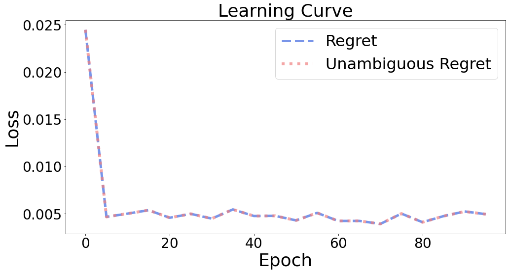

Evaluation
++++++++++

Regret
======

``pyepo.metric.regret`` evaluates the decision quality of a prediction model. Regret is defined as :math:`l_{Regret}(\hat{\mathbf{c}}, \mathbf{c}) = \mathbf{c}^\top \mathbf{w}^*(\hat{\mathbf{c}}) - \mathbf{c}^\top \mathbf{w}^*(\mathbf{c})`, which measures the excess cost of the predicted solution over the true optimum. By default the instances are aggregated as the normalized regret :math:`\sum_i l_i \, / \, \sum_i |\mathbf{c}_i^\top \mathbf{w}^*(\mathbf{c}_i)|`, dimensionless and comparable across problem scales; ``reduction`` switches to ``"sum"``, ``"mean"``, or ``"none"`` (per-instance array).

.. autofunction:: pyepo.metric.regret
    :noindex:

.. code-block:: python

   import pyepo

   regret = pyepo.metric.regret(predmodel, optmodel, testloader)

Unambiguous Regret
==================

When a predicted cost vector :math:`\hat{\mathbf{c}}` yields multiple optimal solutions for :math:`\underset{\mathbf{w} \in S}{\min}\;\hat{\mathbf{c}}^T \mathbf{w}`, the regret depends on which optimum the solver happens to return. The unambiguous regret removes this ambiguity by scoring the worst case: :math:`l_{URegret}(\hat{\mathbf{c}}, \mathbf{c}) = \underset{\mathbf{w} \in W^*(\hat{\mathbf{c}})}{\max} \mathbf{w}^\top \mathbf{c} - \mathbf{c}^\top \mathbf{w}^*(\mathbf{c})`.

Regret depends on the solution returned by the solver when the predicted objective has multiple optima. Unambiguous regret evaluates the worst optimal solution under the predicted objective.

.. autofunction:: pyepo.metric.unambRegret
    :noindex:

.. code-block:: python

   import pyepo

   regret = pyepo.metric.unambRegret(predmodel, optmodel, testloader)
