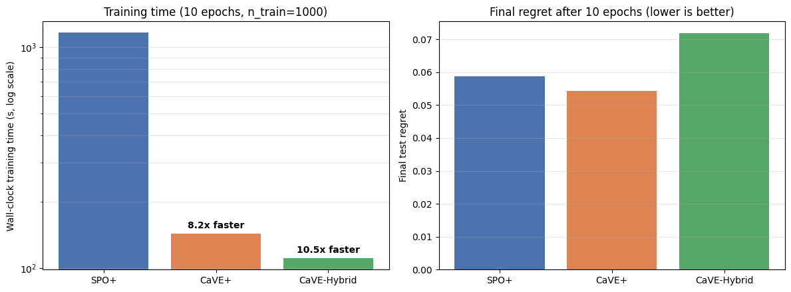

Training Methods
+++++++++++++++++

Overview
========

``pyepo.func`` provides PyTorch autograd modules that wrap an optimization solver for end-to-end training. All modules assume a linear objective with known, fixed constraints; the cost vector is predicted from contextual features.

The modules fall into two interfaces:

* **Loss-returning modules** produce a scalar loss and feed straight into ``.backward()``.
* **Solution-returning modules** produce predicted, expected, or regularized solutions; the user defines a task loss on top.

For training-loop templates, see :doc:`training`.

Choosing a Method
=================

The modules differ in what they return, which determines how you use them:

* **Loss-returning** — return a scalar loss, passed directly to ``.backward()``: SPO+, PFYL, RFYL, NCE, CMAP, LTR, PG, CaVE.
* **Solution-returning** — return a predicted, expected, or regularized solution, on which you define a task loss: DPO, DBB, NID, RFWO, I-MLE, AI-MLE.

A combined name like ``DPO+MSE`` or ``NID+L1`` denotes a solution-returning module (DPO, NID) followed by a task loss (here MSE or L1) on its output.

The table below summarizes each module's return type, typical supervision, and notes.

.. list-table::
   :header-rows: 1
   :widths: 18 28 28 26

   * - Module
     - Returns
     - Typical supervision
     - Notes
   * - ``SPOPlus``
     - loss
     - true costs, true optimal solutions, true objective values
     - convex surrogate for regret
   * - ``PG``
     - loss
     - true costs
     - directional finite differences along the true cost
   * - ``DPO`` / ``DPOMul``
     - expected perturbed solutions
     - task loss chosen by the user
     - DPO; use the multiplicative variant for sign-sensitive oracles
   * - ``PFY`` / ``PFYMul``
     - loss
     - true optimal solutions
     - PFYL; use the multiplicative variant for sign-sensitive oracles
   * - ``IMLE`` / ``AIMLE``
     - perturbed solutions
     - task loss chosen by the user
     - perturb-and-MAP with Sum-of-Gamma noise
   * - ``RFWO``
     - regularized predicted solutions
     - task loss chosen by the user
     - L2-regularized smooth optimizer over the convex hull of feasible solutions
   * - ``RFY``
     - loss
     - true optimal solutions
     - Fenchel-Young loss paired with L2-regularized Frank-Wolfe
   * - ``DBB`` / ``NID``
     - predicted solutions
     - task loss chosen by the user
     - direct solution-level or objective-level losses
   * - ``CaVE``
     - loss
     - tight binding-constraint normals at the true optimum (``optDatasetConstrs``)
     - CaVE; binary linear programs, Gurobi backend only
   * - ``NCE`` / ``CMAP``
     - loss
     - true optimal solutions and a solution pool
     - contrastive training with cached negative solutions
   * - ``ptLTR`` / ``prLTR`` / ``lsLTR``
     - loss
     - true costs and a solution pool
     - learning-to-rank formulations over feasible solutions

Surrogate Losses
================

Surrogate losses replace the non-differentiable regret with a differentiable training objective.

Smart Predict-then-Optimize+ Loss (SPO+)
----------------------------------------

SPO+ [#f1]_ is a convex surrogate loss for the SPO Loss (regret), which measures the decision error of an optimization problem.

The derivation starts from the observation that for any :math:`\alpha \geq 0`,

.. math::

   \mathrm{regret}(\hat{\mathbf{c}}, \mathbf{c}) \leq \max_{\mathbf{w} \in \mathcal{S}} \big\{ \mathbf{c}^\top \mathbf{w} - \alpha\, \hat{\mathbf{c}}^\top \mathbf{w} \big\} + z^*(\alpha \hat{\mathbf{c}}) - z^*(\mathbf{c}).

Setting :math:`\alpha = 2` and bounding :math:`z^*(2 \hat{\mathbf{c}}) \leq 2 \hat{\mathbf{c}}^\top \mathbf{w}^*(\mathbf{c})` via the concavity of :math:`z^*` gives the SPO+ loss,

.. math::

   \mathcal{L}_{\mathrm{SPO+}}(\hat{\mathbf{c}}, \mathbf{c}) = -z^*(2 \hat{\mathbf{c}} - \mathbf{c}) + 2\, \hat{\mathbf{c}}^\top \mathbf{w}^*(\mathbf{c}) - z^*(\mathbf{c}),

which is convex in :math:`\hat{\mathbf{c}}` and upper-bounds the regret. By Danskin's theorem, a subgradient is

.. math::

   2 \big( \mathbf{w}^*(\mathbf{c}) - \mathbf{w}^*(2 \hat{\mathbf{c}} - \mathbf{c}) \big) \in \frac{\partial \mathcal{L}_{\mathrm{SPO+}}(\hat{\mathbf{c}}, \mathbf{c})}{\partial \hat{\mathbf{c}}}.

.. autoclass:: pyepo.func.SPOPlus
    :noindex:
    :members:

``processes`` sets the number of solver processes (``0`` uses all available cores).

Perturbation Gradient (PG)
--------------------------

PG [#f11]_ is a surrogate loss based on zeroth-order gradient approximation via Danskin's theorem. It uses finite differences along the true cost direction.

By Danskin's theorem, regret can be written as the directional derivative of :math:`z^*(\hat{\mathbf{c}})` along :math:`\mathbf{c}` (up to a constant independent of :math:`\hat{\mathbf{c}}`). PG approximates this directional derivative with finite differences. Two variants are available, backward (``two_sides=False``) and central (``two_sides=True``):

.. math::

   \mathcal{L}_{\mathrm{PG}}^{\mathrm{back}}(\hat{\mathbf{c}}, \mathbf{c}) &\approx \frac{z^*(\hat{\mathbf{c}}) - z^*(\hat{\mathbf{c}} - \lambda \mathbf{c})}{\lambda}, \\
   \mathcal{L}_{\mathrm{PG}}^{\mathrm{cent}}(\hat{\mathbf{c}}, \mathbf{c}) &\approx \frac{z^*(\hat{\mathbf{c}} + \lambda \mathbf{c}) - z^*(\hat{\mathbf{c}} - \lambda \mathbf{c})}{2 \lambda},

where :math:`\lambda > 0` is the finite-difference width (the ``sigma`` parameter). The corresponding gradient estimate is

.. math::

   \frac{\partial \mathcal{L}_{\mathrm{PG}}^{\mathrm{back}}(\hat{\mathbf{c}}, \mathbf{c})}{\partial \hat{\mathbf{c}}} \approx \frac{\mathbf{w}^*(\hat{\mathbf{c}}) - \mathbf{w}^*(\hat{\mathbf{c}} - \lambda \mathbf{c})}{\lambda}.

.. autoclass:: pyepo.func.PG
    :noindex:
    :members:

``sigma`` controls the finite-difference width. ``two_sides`` enables central differencing.

Perturbed Methods
=================

Perturbed methods estimate gradients by Monte Carlo averaging over random perturbations of the cost vector. They share two design knobs: ``n_samples`` (number of Monte Carlo samples) and ``sigma`` (perturbation amplitude).

Differentiable Perturbed Optimizer (DPO)
----------------------------------------

DPO [#f5]_ uses Monte Carlo sampling to estimate solutions by optimizing randomly perturbed costs. Its custom backward pass provides a gradient estimator for end-to-end training. ``DPO`` is the additive Gaussian version; ``DPOMul`` is the multiplicative version for sign-sensitive oracles [#f6]_. The multiplicative variant assumes predicted costs already have the intended nonzero sign. For nonnegative-cost problems, use a positive-output predictor such as ``nn.Softplus()`` plus a small epsilon.

DPO replaces the piecewise-constant solution map :math:`\hat{\mathbf{c}} \mapsto \mathbf{w}^*(\hat{\mathbf{c}})` with the expectation over a random perturbation,

.. math::

   \mathbb{E}_{\boldsymbol{\xi}} \big[ \mathbf{w}^*(\hat{\mathbf{c}} + \sigma \boldsymbol{\xi}) \big] \approx \frac{1}{K} \sum_{\kappa=1}^{K} \mathbf{w}^*(\hat{\mathbf{c}} + \sigma \boldsymbol{\xi}_\kappa),

where :math:`\boldsymbol{\xi} \sim \mathcal{N}(\mathbf{0}, \mathbf{I})` and :math:`K` is ``n_samples``.

The multiplicative variant ``DPOMul`` perturbs each entry of :math:`\hat{\mathbf{c}}` as

.. math::

   \hat{\mathbf{c}} \odot \exp\!\big(\sigma \boldsymbol{\xi} - \tfrac{1}{2} \sigma^2\big),

with :math:`\odot` the Hadamard product. The exponential factor preserves the sign of each cost entry, which is required when the solver expects (say) nonnegative edge costs.

.. autoclass:: pyepo.func.DPO
    :noindex:
    :members:

.. autoclass:: pyepo.func.DPOMul
    :noindex:
    :members:

Perturbed Fenchel-Young Loss (PFYL)
-----------------------------------

PFYL [#f5]_ uses the same perturbed expected solution as DPO inside a Fenchel-Young loss, comparing it directly with the true optimal solution. It returns a scalar loss. ``PFY`` is the additive Gaussian version; ``PFYMul`` is the multiplicative sign-preserving variant with the same sign convention as ``DPOMul``.

Let :math:`F(\hat{\mathbf{c}}) = \mathbb{E}_{\boldsymbol{\xi}}\big[ \min_{\mathbf{w} \in \mathcal{S}} (\hat{\mathbf{c}} + \sigma \boldsymbol{\xi})^\top \mathbf{w} \big]` be the expected perturbed minimum, and let :math:`\Omega(\mathbf{w}^*(\mathbf{c}))` be its Fenchel conjugate. The perturbed Fenchel-Young loss is

.. math::

   \mathcal{L}_{\mathrm{PFYL}}(\hat{\mathbf{c}}, \mathbf{w}^*(\mathbf{c})) = \hat{\mathbf{c}}^\top \mathbf{w}^*(\mathbf{c}) - F(\hat{\mathbf{c}}) - \Omega(\mathbf{w}^*(\mathbf{c})).

The dual term :math:`\Omega(\mathbf{w}^*(\mathbf{c}))` does not depend on :math:`\hat{\mathbf{c}}`, so the gradient collapses to a simple difference of solutions,

.. math::

   \frac{\partial \mathcal{L}_{\mathrm{PFYL}}(\hat{\mathbf{c}}, \mathbf{w}^*(\mathbf{c}))}{\partial \hat{\mathbf{c}}} = \mathbf{w}^*(\mathbf{c}) - \mathbb{E}_{\boldsymbol{\xi}} \big[\mathbf{w}^*(\hat{\mathbf{c}} + \sigma \boldsymbol{\xi})\big] \approx \mathbf{w}^*(\mathbf{c}) - \frac{1}{K} \sum_{\kappa=1}^{K} \mathbf{w}^*(\hat{\mathbf{c}} + \sigma \boldsymbol{\xi}_\kappa).

The multiplicative variant uses the same sign-preserving perturbation,

.. math::

   \hat{\mathbf{c}} \odot \exp\!\big(\sigma \boldsymbol{\xi} - \tfrac{1}{2} \sigma^2\big).

.. autoclass:: pyepo.func.PFY
    :noindex:
    :members:

.. autoclass:: pyepo.func.PFYMul
    :noindex:
    :members:

Implicit Maximum Likelihood Estimator (I-MLE)
---------------------------------------------

I-MLE [#f9]_ uses the perturb-and-MAP framework, sampling noise from a Sum-of-Gamma distribution and interpolating the loss function to approximate finite differences. ``lambd`` controls the interpolation step.

I-MLE is framed as imitation learning: bring the model distribution :math:`p(\mathbf{w} \mid \hat{\mathbf{c}})` closer to a target distribution :math:`q(\mathbf{w} \mid \hat{\mathbf{c}})` by minimizing their KL divergence. An upstream task gradient :math:`\mathbf{d} = \nabla_{\mathbf{w}} \mathcal{L}(\hat{\mathbf{c}}, \cdot) \big|_{\mathbf{w} = \mathbf{w}^*(\hat{\mathbf{c}})}` induces a virtual update :math:`\hat{\mathbf{c}}' = \hat{\mathbf{c}} + \lambda \mathbf{d}`, and the gradient is estimated by a directional finite difference between the smoothed solutions at :math:`\hat{\mathbf{c}}'` and :math:`\hat{\mathbf{c}}`:

.. math::

   \frac{\partial \mathcal{L}_{\mathrm{IMLE}}(\hat{\mathbf{c}}, \cdot)}{\partial \hat{\mathbf{c}}} \approx \frac{1}{K \lambda} \sum_{\kappa=1}^{K} \Big( \mathbf{w}^*(\hat{\mathbf{c}} + \lambda \mathbf{d} + \sigma \boldsymbol{\xi}_\kappa) - \mathbf{w}^*(\hat{\mathbf{c}} + \sigma \boldsymbol{\xi}_\kappa) \Big),

where :math:`\sigma` smooths the solution map and :math:`\lambda` (``lambd``) is the finite-difference step. The same noise realization :math:`\boldsymbol{\xi}_\kappa` is shared across the two perturbed evaluations to reduce variance.

.. autoclass:: pyepo.func.IMLE
    :noindex:
    :members:

Adaptive Implicit Maximum Likelihood Estimator (AI-MLE)
-------------------------------------------------------

AI-MLE [#f10]_ extends I-MLE with an adaptive interpolation step for better gradient estimates.

AI-MLE uses the same finite-difference estimator as I-MLE but replaces the fixed step size :math:`\lambda` with an adaptive choice driven by the magnitudes of the predicted cost and the upstream gradient,

.. math::

   \lambda_t = \alpha_t \cdot \frac{\|\hat{\mathbf{c}}\|_2}{\|\mathbf{d}\|_2},

where :math:`\mathbf{d}` is the upstream task gradient and :math:`\alpha_t > 0` is tuned online: when an exponential moving average of the gradient sparsity (fraction of nonzero entries) drops below one, :math:`\alpha_t` is increased; otherwise it is decreased. This rescaling keeps the perturbation magnitude commensurate with :math:`\hat{\mathbf{c}}` and decouples the step from the absolute scale of :math:`\mathbf{d}`, removing the need to tune :math:`\lambda` by hand.

.. autoclass:: pyepo.func.AIMLE
    :noindex:
    :members:

Regularized Methods
===================

A pure linear optimization layer is not differentiable: the optimal solution :math:`\mathbf{w}^*(\hat{\mathbf{c}}) = \arg\min_{\mathbf{w} \in \mathcal{S}} \hat{\mathbf{c}}^\top \mathbf{w}` is piecewise constant in :math:`\hat{\mathbf{c}}`. It jumps between vertices of :math:`\mathcal{S}`, and its derivative is zero almost everywhere. Regularized methods fix this by adding a strongly convex regularizer :math:`\Omega` to the linear objective, yielding a regularized solution

.. math::

   \hat{\mathbf{w}}_\Omega(\hat{\mathbf{c}}) = \arg\min_{\mathbf{w} \in \mathrm{conv}(\mathcal{S})} \hat{\mathbf{c}}^\top \mathbf{w} + \Omega(\mathbf{w}),

which is unique, lies inside :math:`\mathrm{conv}(\mathcal{S})`, and varies continuously with :math:`\hat{\mathbf{c}}`. This deterministic smoothing is dual to the stochastic smoothing of the perturbed methods above: both replace the piecewise-constant solution map with a continuous surrogate, the former via a convex regularizer and the latter via Monte Carlo averaging over a noise distribution [#f6]_.

PyEPO implements the L2 special case :math:`\Omega(\mathbf{w}) = \tfrac{\lambda}{2} \|\mathbf{w}\|_2^2` and solves the regularized program with batched Frank-Wolfe iteration. Frank-Wolfe accesses :math:`\mathrm{conv}(\mathcal{S})` through the original LP/ILP solver of :math:`\mathcal{S}` (a *linear minimization oracle*). ``lambd`` is the L2 strength :math:`\lambda`; ``max_iter`` caps Frank-Wolfe iterations and ``tol`` is the convergence tolerance.

L2 Regularized Frank-Wolfe (RFWO)
---------------------------------

RFWO [#f6]_ exposes :math:`\hat{\mathbf{w}}_\lambda(\hat{\mathbf{c}})` directly as a differentiable layer. Since it returns a (regularized) solution rather than a loss, the user defines a task loss on the output, most commonly an MSE against :math:`\mathbf{w}^*(\mathbf{c})`, matching the imitation setting in the original paper.

.. math::

   \hat{\mathbf{w}}_\lambda(\hat{\mathbf{c}}) = \arg\min_{\mathbf{w} \in \mathrm{conv}(\mathcal{S})} \hat{\mathbf{c}}^\top \mathbf{w} + \tfrac{\lambda}{2} \|\mathbf{w}\|_2^2.

.. autoclass:: pyepo.func.RFWO
    :noindex:
    :members:

L2 Regularized Frank-Wolfe with Fenchel-Young Loss (RFYL)
---------------------------------------------------------

RFYL [#f6]_ pairs the RFWO layer with the **Fenchel-Young loss** [#f13]_ of the regularizer :math:`\Omega`, returning a scalar loss that compares the predicted cost :math:`\hat{\mathbf{c}}` to the true optimum :math:`\mathbf{w}^*(\mathbf{c})`.

For any convex regularizer :math:`\Omega: \mathrm{conv}(\mathcal{S}) \to \mathbb{R}` with conjugate :math:`\Omega^*(\boldsymbol{\theta}) = \sup_{\mathbf{w}} \boldsymbol{\theta}^\top \mathbf{w} - \Omega(\mathbf{w})`, the Fenchel-Young loss is

.. math::

   \mathcal{L}_\Omega^{\mathrm{FY}}(\hat{\mathbf{c}}, \mathbf{w}^*(\mathbf{c})) = \Omega(\mathbf{w}^*(\mathbf{c})) + \Omega^*(-\hat{\mathbf{c}}) + \hat{\mathbf{c}}^\top \mathbf{w}^*(\mathbf{c}).

The Fenchel-Young inequality gives three properties used by the training loss:

1. **Non-negative**, with equality iff :math:`\mathbf{w}^*(\mathbf{c}) = \hat{\mathbf{w}}_\Omega(\hat{\mathbf{c}})`.
2. **Convex** in :math:`\hat{\mathbf{c}}`.
3. By Danskin's theorem, the gradient is the residual between the regularized prediction and the target,

   .. math::

      \frac{\partial \mathcal{L}_\Omega^{\mathrm{FY}}(\hat{\mathbf{c}}, \mathbf{w}^*(\mathbf{c}))}{\partial \hat{\mathbf{c}}} = \mathbf{w}^*(\mathbf{c}) - \hat{\mathbf{w}}_\Omega(\hat{\mathbf{c}}),

   without differentiating through the Frank-Wolfe iterate.

PyEPO specializes this to :math:`\Omega(\mathbf{w}) = \tfrac{\lambda}{2}\|\mathbf{w}\|_2^2`. Substituting the closed form of :math:`\Omega^*` and the definition of :math:`\hat{\mathbf{w}}_\lambda` collapses the loss to

.. math::

   \mathcal{L}_{\mathrm{RFYL}}(\hat{\mathbf{c}}, \mathbf{w}^*(\mathbf{c})) = \Omega(\mathbf{w}^*(\mathbf{c})) - \Omega(\hat{\mathbf{w}}_\lambda(\hat{\mathbf{c}})) + \hat{\mathbf{c}}^\top \big( \mathbf{w}^*(\mathbf{c}) - \hat{\mathbf{w}}_\lambda(\hat{\mathbf{c}}) \big),

a "compare regularizers + linear residual" form. The gradient remains :math:`\mathbf{w}^*(\mathbf{c}) - \hat{\mathbf{w}}_\lambda(\hat{\mathbf{c}})`.

.. autoclass:: pyepo.func.RFY
    :noindex:
    :members:

Black-Box Methods
=================

Black-box methods replace the zero gradient of the discrete solver with a surrogate backward rule.

Differentiable Black-Box Optimizer (DBB)
----------------------------------------

DBB [#f3]_ estimates gradients via interpolation, replacing the zero gradients of the combinatorial solver. ``lambd`` is a smoothing hyperparameter.

Given an upstream gradient :math:`\mathbf{d} = \nabla_{\mathbf{w}} \mathcal{L}(\hat{\mathbf{c}}, \cdot) \big|_{\mathbf{w} = \mathbf{w}^*(\hat{\mathbf{c}})}`, DBB approximates the vector-Jacobian product by interpolating the loss between :math:`\hat{\mathbf{c}}` and a perturbed cost :math:`\hat{\mathbf{c}} + \lambda \mathbf{d}`, yielding

.. math::

   \frac{\partial \mathcal{L}(\hat{\mathbf{c}}, \cdot)}{\partial \hat{\mathbf{c}}} \approx \frac{\mathbf{w}^*(\hat{\mathbf{c}} + \lambda \mathbf{d}) - \mathbf{w}^*(\hat{\mathbf{c}})}{\lambda}.

Larger :math:`\lambda` smooths more aggressively. Unlike SPO+, the resulting surrogate is nonconvex in :math:`\hat{\mathbf{c}}`, which weakens convergence guarantees even when the predictor is convex in its parameters.

.. autoclass:: pyepo.func.DBB
    :noindex:
    :members:

Negative Identity Backpropagation (NID)
---------------------------------------

NID [#f4]_ treats the solver as a negative identity mapping during backpropagation. This is equivalent to DBB with a specific hyperparameter setting. NID is hyperparameter-free and requires no additional solver calls during the backward pass.

NID approximates the solver Jacobian by the (signed) identity, :math:`\partial \mathbf{w}^*(\hat{\mathbf{c}}) / \partial \hat{\mathbf{c}} \approx -\mathbf{I}` for a minimization problem (and :math:`+\mathbf{I}` for maximization). Given an upstream gradient :math:`\mathbf{d} = \partial \mathcal{L}(\hat{\mathbf{c}}, \cdot) / \partial \mathbf{w}^*(\hat{\mathbf{c}})`, the chain rule gives a sign-flipped straight-through estimator,

.. math::

   \frac{\partial \mathcal{L}(\hat{\mathbf{c}}, \cdot)}{\partial \hat{\mathbf{c}}} \approx -\mathbf{d} \quad (\text{minimization}), \qquad \frac{\partial \mathcal{L}(\hat{\mathbf{c}}, \cdot)}{\partial \hat{\mathbf{c}}} \approx \mathbf{d} \quad (\text{maximization}).

Intuitively, for minimization this rule decreases :math:`\hat{\mathbf{c}}` along directions where :math:`\mathbf{w}^*(\hat{\mathbf{c}})` tends to increase and vice versa, driving the predicted decision toward :math:`\mathbf{w}^*(\mathbf{c})`. NID is the special case of DBB in which :math:`\lambda` is chosen so that the interpolated solution coincides with the negative-identity update, but it saves the extra solver call required by DBB.

.. autoclass:: pyepo.func.NID
    :noindex:
    :members:

Cone-Aligned Estimation
=======================

Cone-aligned losses supervise the *predicted cost vector* directly by aligning it with the polyhedral cone of binding-constraint normals at the true optimum, rather than supervising on the optimal solution itself.

Cone-Aligned Vector Estimation (CaVE)
-------------------------------------

CaVE [#f12]_ is a surrogate loss for **binary linear programs** (TSP, CVRP, knapsack, shortest path with binary edges, etc.). For each instance, it projects the sense-flipped predicted cost vector onto the polyhedral cone spanned by the binding-constraint normals at the true optimal vertex, then minimizes ``1 - cos(pred, proj)``.

For a runnable walkthrough, see the `04 CaVE for Binary Linear Programs <https://colab.research.google.com/github/khalil-research/PyEPO/blob/main/notebooks/04%20CaVE%20for%20Binary%20Linear%20Programs.ipynb>`_ notebook.

Let :math:`K(\mathbf{w}^*(\mathbf{c}))` be the polyhedral cone spanned by the constraint normals that bind at the true optimal vertex. For a minimization problem, the KKT conditions require :math:`-\hat{\mathbf{c}} \in K(\mathbf{w}^*(\mathbf{c}))` for :math:`\mathbf{w}^*(\mathbf{c})` to remain optimal under the predicted cost. CaVE measures this alignment via a cosine loss against the cone projection :math:`\mathbf{p} = \mathrm{proj}_{K}(-\hat{\mathbf{c}})`,

.. math::

   \mathcal{L}_{\mathrm{CaVE}}(\hat{\mathbf{c}}, K) = 1 - \frac{(-\hat{\mathbf{c}})^\top \mathbf{p}}{\|\hat{\mathbf{c}}\|_2\, \|\mathbf{p}\|_2}.

When :math:`-\hat{\mathbf{c}}` already lies inside the cone, :math:`\mathbf{p} = -\hat{\mathbf{c}}` and the loss is zero; the further :math:`-\hat{\mathbf{c}}` strays outside the cone, the larger the loss.

CaVE uses two solvers at different stages: a Gurobi-backed ``optModel`` extracts the binding-constraint normals when the dataset is built, and Clarabel projects the predicted cost onto that cone during training. This avoids solving an ILP in every training step. ``max_iter`` controls the number of Clarabel iterations.

Setting ``solve_ratio < 1`` enables the hybrid update: each batch uses the QP projection with probability ``solve_ratio`` and otherwise uses a blend of the normalized predicted cost and the average binding-constraint normal. ``inner_ratio`` controls the blend.

    CVRP-20 results from notebook 04: ``num_data=1000``, 10 epochs, single process. In this setup, CaVE+ trains 8.2x faster than SPO+; CaVE-Hybrid with ``solve_ratio=0.3`` trains 10.5x faster with higher final regret.

Training data comes from ``pyepo.data.dataset.optDatasetConstrs``, which extracts the binding-constraint normals at the optimum for each instance. Use ``pyepo.data.dataset.collate_tight_constraints`` to zero-pad ragged per-instance constraint counts. CaVE currently requires a Gurobi-backed ``optModel``.

.. autoclass:: pyepo.func.CaVE
    :noindex:
    :members:

If you use the **CaVE** loss, please cite:

.. code-block:: bibtex

   @inproceedings{tang2024cave,
     title={CaVE: A Cone-Aligned Approach for Fast Predict-then-Optimize with Binary Linear Programs},
     author={Tang, Bo and Khalil, Elias B},
     booktitle={Integration of Constraint Programming, Artificial Intelligence, and Operations Research},
     pages={193--210},
     year={2024},
     publisher={Springer}
   }

Contrastive Methods
===================

Contrastive methods train against a pool of cached non-optimal solutions, treated as negative examples. ``solve_ratio`` controls how often new instances are solved exactly during training; ``dataset`` seeds the pool. See :doc:`../advanced/pool` for details on the solution-pool mechanism.

Noise Contrastive Estimation (NCE)
----------------------------------

NCE [#f7]_ is a surrogate loss based on negative examples. It uses a small set of non-optimal solutions as negative samples to maximize the probability gap between the optimal solution and the rest.

Let :math:`\Gamma` be the cached pool of feasible solutions. For a minimization problem, NCE averages the predicted-cost margin between :math:`\mathbf{w}^*(\mathbf{c})` and every member of the pool,

.. math::

   \mathcal{L}_{\mathrm{NCE}}(\hat{\mathbf{c}}, \mathbf{c}) = \frac{1}{|\Gamma|} \sum_{\mathbf{w} \in \Gamma} \big( \hat{\mathbf{c}}^\top \mathbf{w}^*(\mathbf{c}) - \hat{\mathbf{c}}^\top \mathbf{w} \big).

(If :math:`\mathbf{w}^*(\mathbf{c}) \in \Gamma`, its term contributes zero and the sum effectively averages over the negatives.) The gradient has a closed form that requires no solver call in the backward pass,

.. math::

   \frac{\partial \mathcal{L}_{\mathrm{NCE}}(\hat{\mathbf{c}}, \mathbf{c})}{\partial \hat{\mathbf{c}}} = \mathbf{w}^*(\mathbf{c}) - \frac{1}{|\Gamma|} \sum_{\mathbf{w} \in \Gamma} \mathbf{w}.

For a fixed :math:`\Gamma`, this update direction stays constant per instance. ``solve_ratio`` controls how often the pool is refreshed.

.. autoclass:: pyepo.func.NCE
    :noindex:
    :members:

Contrastive MAP (CMAP)
----------------------

CMAP [#f7]_ is a special case of NCE that uses only the single best negative sample.

CMAP keeps only the most-violating member of the pool, the one with the smallest predicted-cost objective, yielding a max-margin contrast against the true optimum. For a minimization problem,

.. math::

   \mathcal{L}_{\mathrm{CMAP}}(\hat{\mathbf{c}}, \mathbf{c}) = \max_{\mathbf{w} \in \Gamma} \big( \hat{\mathbf{c}}^\top \mathbf{w}^*(\mathbf{c}) - \hat{\mathbf{c}}^\top \mathbf{w} \big) = \hat{\mathbf{c}}^\top \mathbf{w}^*(\mathbf{c}) - \min_{\mathbf{w} \in \Gamma} \hat{\mathbf{c}}^\top \mathbf{w}.

If :math:`\mathbf{w}^*(\mathbf{c}) \in \Gamma`, that entry contributes a zero margin, so the loss is non-negative and vanishes precisely when the predicted costs already make :math:`\mathbf{w}^*(\mathbf{c})` the minimizer over :math:`\Gamma`.

.. autoclass:: pyepo.func.CMAP
    :noindex:
    :members:

Learning to Rank
================

Learning to rank [#f8]_ treats predict-then-optimize training as ranking a pool of feasible solutions: predicted costs assign scores to solutions, and the loss encourages the optimal solution to rank highest. Each variant differs in how it scores the ranking. Like contrastive methods, LTR uses ``solve_ratio`` and ``dataset`` to manage the pool.

* **Pointwise** regresses each predicted score :math:`\hat{\mathbf{c}}^\top \mathbf{w}` toward the true value :math:`\mathbf{c}^\top \mathbf{w}` for every :math:`\mathbf{w} \in \Gamma`.
* **Pairwise** enforces a margin between the optimal solution and each suboptimal one.
* **Listwise** models the full ranking distribution with a SoftMax over predicted scores,

  .. math::

     P(\mathbf{w}' \mid \hat{\mathbf{c}}) = \frac{\exp(\hat{\mathbf{c}}^\top \mathbf{w}')}{\sum_{\mathbf{w} \in \Gamma} \exp(\hat{\mathbf{c}}^\top \mathbf{w})},

  and minimizes the cross-entropy against the true ranking distribution,

  .. math::

     \mathcal{L}_{\mathrm{LTR}}^{\mathrm{list}}(\hat{\mathbf{c}}, \mathbf{c}) = -\frac{1}{|\Gamma|} \sum_{\mathbf{w} \in \Gamma} P(\mathbf{w} \mid \mathbf{c}) \log P(\mathbf{w} \mid \hat{\mathbf{c}}).

  The gradient has a closed form,

  .. math::

     \frac{\partial \mathcal{L}_{\mathrm{LTR}}^{\mathrm{list}}(\hat{\mathbf{c}}, \mathbf{c})}{\partial \hat{\mathbf{c}}} = \frac{1}{|\Gamma|} \Big( \sum_{\mathbf{w} \in \Gamma} P(\mathbf{w} \mid \hat{\mathbf{c}})\, \mathbf{w} - \sum_{\mathbf{w} \in \Gamma} P(\mathbf{w} \mid \mathbf{c})\, \mathbf{w} \Big).

Pointwise LTR
-------------

Pointwise loss computes ranking scores for individual solutions.

.. autoclass:: pyepo.func.ptLTR
    :noindex:
    :members:

Pairwise LTR
------------

Pairwise loss learns the relative ordering between pairs of solutions.

.. autoclass:: pyepo.func.prLTR
    :noindex:
    :members:

Listwise LTR
------------

Listwise loss evaluates scores over the entire ranked list.

.. autoclass:: pyepo.func.lsLTR
    :noindex:
    :members:

Parallel Computation
====================

All ``pyepo.func`` modules support parallel solving during training via the ``processes`` parameter (``0`` uses all available cores).

.. image:: ../../images/parallel-tsp.png
   :width: 650
   :class: light-bg

The figure shows that increasing the number of processes reduces runtime.

.. rubric:: Footnotes

.. [#f1] Elmachtoub, A. N., & Grigas, P. (2021). Smart "predict, then optimize". Management Science.
.. [#f3] Vlastelica, M., Paulus, A., Musil, V., Martius, G., & Rolinek, M. (2019). Differentiation of blackbox combinatorial solvers. arXiv preprint arXiv:1912.02175.
.. [#f4] Sahoo, S. S., Paulus, A., Vlastelica, M., Musil, V., Kuleshov, V., & Martius, G. (2022). Backpropagation through combinatorial algorithms: Identity with projection works. arXiv preprint arXiv:2205.15213.
.. [#f5] Berthet, Q., Blondel, M., Teboul, O., Cuturi, M., Vert, J. P., & Bach, F. (2020). Learning with differentiable perturbed optimizers. Advances in Neural Information Processing Systems, 33, 9508-9519.
.. [#f6] Dalle, G., Baty, L., Bouvier, L., & Parmentier, A. (2022). Learning with Combinatorial Optimization Layers: a Probabilistic Approach. arXiv preprint arXiv:2207.13513.
.. [#f7] Mulamba, M., Mandi, J., Diligenti, M., Lombardi, M., Bucarey, V., & Guns, T. (2021). Contrastive losses and solution caching for predict-and-optimize. Proceedings of the Thirtieth International Joint Conference on Artificial Intelligence.
.. [#f8] Mandi, J., Bucarey, V., Mulamba, M., & Guns, T. (2022). Decision-focused learning: through the lens of learning to rank. Proceedings of the 39th International Conference on Machine Learning.
.. [#f9] Niepert, M., Minervini, P., & Franceschi, L. (2021). Implicit MLE: backpropagating through discrete exponential family distributions. Advances in Neural Information Processing Systems, 34, 14567-14579.
.. [#f10] Minervini, P., Franceschi, L., & Niepert, M. (2023). Adaptive perturbation-based gradient estimation for discrete latent variable models. Proceedings of the AAAI Conference on Artificial Intelligence.
.. [#f11] Gupta, V., & Huang, M. (2024). Decision-Focused Learning with Directional Gradients. arXiv preprint arXiv:2402.03256.
.. [#f12] Tang, B., & Khalil, E. B. (2024). CaVE: A Cone-Aligned Approach for Fast Predict-then-Optimize with Binary Linear Programs. In Integration of Constraint Programming, Artificial Intelligence, and Operations Research (pp. 193-210).
.. [#f13] Blondel, M., Martins, A. F. T., & Niculae, V. (2020). Learning with Fenchel-Young losses. Journal of Machine Learning Research, 21(35), 1-69.
