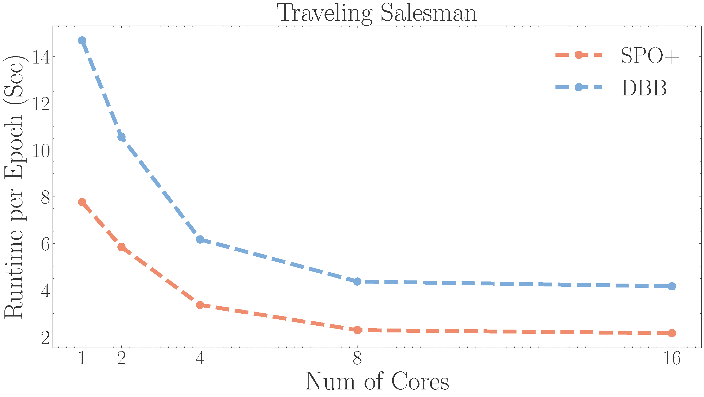

Training Methods
+++++++++++++++++

Overview
========

``pyepo.func`` provides PyTorch autograd modules that wrap an optimization solver for end-to-end training. All modules assume a linear objective with known, fixed constraints. The cost vector is predicted from contextual features. If a DSL-compiled model includes a quadratic objective term, the training module raises at construction.

Every module accepts ``processes`` for parallel solving. All modules except ``CaVE`` accept ``solve_ratio < 1`` with ``dataset`` for solution-pool caching (see :doc:`../advanced/pool`). ``CaVE`` uses ``solve_ratio`` for its projection branch instead. Modules that return a loss also accept ``reduction`` (``"mean"``, ``"sum"``, or ``"none"``).

Each method family has its own page, linked under **Method Families** below. Every training loop there is presented with its definition and builds on the shared **Common Setup** on this page.

Choosing a Method
=================

The modules differ in what they return, which determines how you use them:

* **Loss-returning**: return a scalar loss that can be passed directly to ``.backward()``: SPO+, PG, PFYL, RFYL, CaVE, NCE, CMAP, LTR.
* **Solution-returning**: return a predicted, expected, or regularized solution. You then define a task loss on that output: DPO, I-MLE, AI-MLE, RFWO, DBB, NID.

A combined name like ``DPO+MSE`` or ``NID+L1`` denotes a solution-returning module (DPO, NID) followed by a task loss (here MSE or L1) on its output.

The table below summarizes each module's return type, typical supervision signal, and main caveats.

.. list-table::
   :header-rows: 1
   :widths: 18 28 28 26

   * - Module
     - Returns
     - Typical supervision
     - Notes
   * - ``SPOPlus``
     - loss
     - true costs, true optimal solutions, true objective values
     - convex surrogate for regret
   * - ``PG``
     - loss
     - true costs
     - directional finite differences along the true cost
   * - ``DPO`` / ``DPOMul``
     - expected perturbed solutions
     - task loss chosen by the user
     - use the multiplicative variant for sign-sensitive oracles
   * - ``PFY`` / ``PFYMul``
     - loss
     - true optimal solutions
     - PFYL; use the multiplicative variant for sign-sensitive oracles
   * - ``IMLE`` / ``AIMLE``
     - expected perturbed solutions
     - task loss chosen by the user
     - perturb-and-MAP with Sum-of-Gamma noise
   * - ``RFWO``
     - regularized predicted solutions
     - task loss chosen by the user
     - L2-regularized smooth optimizer over the convex hull of feasible solutions
   * - ``RFY``
     - loss
     - true optimal solutions
     - RFYL; Fenchel-Young loss paired with L2-regularized Frank-Wolfe
   * - ``DBB`` / ``NID``
     - predicted solutions
     - task loss chosen by the user
     - direct solution-level or objective-level losses
   * - ``CaVE``
     - loss
     - tight binding-constraint normals at the true optimum (``optDatasetConstrs``)
     - binary linear programs, Gurobi backend only
   * - ``NCE`` / ``CMAP``
     - loss
     - true optimal solutions and a solution pool
     - contrastive training with cached negative solutions
   * - ``ptLTR`` / ``prLTR`` / ``lsLTR``
     - loss
     - true costs and a solution pool
     - learning-to-rank formulations over feasible solutions

Method Families
===============

Each family has its own page:

.. toctree::
   :maxdepth: 1

   methods/surrogate
   methods/perturbed
   methods/regularized
   methods/blackbox
   methods/cone
   methods/contrastive
   methods/ranking

.. _common-setup:

Common Setup
============

All training loops share the same setup: a DSL-defined knapsack problem with a linear predictor. The examples use PyTorch. JAX follows the same method families. See :doc:`../frontends/jax`. For a runnable walkthrough, see the `03 Training and Testing <https://colab.research.google.com/github/khalil-research/PyEPO/blob/main/notebooks/03%20Training%20and%20Testing.ipynb>`_ notebook.

.. code-block:: python

   import pyepo
   from pyepo import EPO, dsl
   import torch
   from torch import nn
   from torch.utils.data import DataLoader

   # generate data
   num_data, num_feat, num_item, num_dim = 1000, 5, 10, 3
   weights, feat, costs = pyepo.data.knapsack.genData(
       num_data, num_feat, num_item, num_dim, deg=4, noise_width=0.5, seed=135,
   )
   capacity = (weights.sum(axis=1) * 0.5).astype(int)

   # define the optimization problem
   x = dsl.Variable(num_item, vtype=EPO.BINARY)
   c = dsl.Parameter(num_item)
   optmodel = dsl.Problem(
       dsl.Maximize(c @ x),
       [weights @ x <= capacity],
   ).compile(backend="gurobi")

   # dataset and data loader
   dataset = pyepo.data.dataset.optDataset(optmodel, feat, costs)
   dataloader = DataLoader(dataset, batch_size=32, shuffle=True)

   # prediction model
   predmodel = nn.Linear(num_feat, num_item)
   optimizer = torch.optim.Adam(predmodel.parameters(), lr=1e-3)

   # for multiplicative perturbed variants
   positive_predmodel = nn.Sequential(nn.Linear(num_feat, num_item), nn.Softplus())

Parallel Computation
====================

All ``pyepo.func`` modules support parallel solving during training through the ``processes`` parameter. Set ``processes=0`` to use all available cores.

The figure reports runtime for different values of ``processes``.
