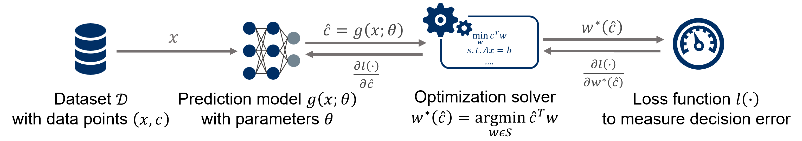

.. image:: ../images/logo1.png
  :width: 1000

Introduction
++++++++++++

The ``PyEPO`` (PyTorch-based End-to-End Predict-then-Optimize Tool) is an open-source software implemented in Python that facilitates the modeling and resolution of predict-then-optimize problems characterized by linear objective functions.

The primary function of ``PyEPO`` is to construct optimization models utilizing `GurobiPy <https://www.gurobi.com/>`_, `Pyomo <http://www.pyomo.org/>`_, or other solvers and algorithms, and then integrating the optimization model within an artificial neural network for end-to-end training. To achieve this, PyEPO incorporates the SPO+ loss, differentiable black-box optimizer, differentiable perturbed optimizers, and Fenchel-Young loss with Perturbation as `PyTorch <https://pytorch.org/>`_ autograd modules.

End-to-End Predict-then-Optimize Framework
------------------------------------------

A labeled dataset :math:`\mathcal{D}` comprising of feature-cost pairs :math:`(x,c)` or feature-solution pairs :math:`(x,w)` is utilized to train a machine learning model, specifically a deep neural network, which directly minimizes the decision error.

