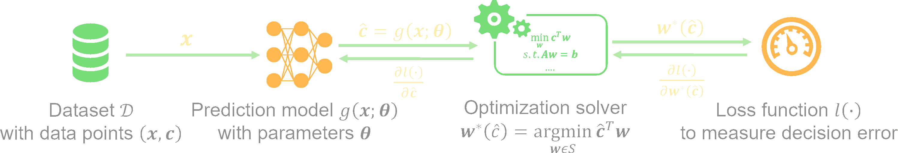

.. image:: ../images/logo1.png
  :width: 1000

Introduction
++++++++++++

``PyEPO`` (PyTorch-based End-to-End Predict-then-Optimize Tool) is a Python library for modeling and solving predict-then-optimize problems with linear objective functions.

``PyEPO`` builds optimization models with `GurobiPy <https://www.gurobi.com/>`_, `COPT <https://shanshu.ai/copt>`_, `Pyomo <http://www.pyomo.org/>`_, `Google OR-Tools <https://developers.google.com/optimization>`_, `MPAX <https://github.com/MIT-Lu-Lab/MPAX>`_, or any custom solver or algorithm, and embeds them into neural networks for end-to-end training. All decision-focused learning methods are implemented as `PyTorch <https://pytorch.org/>`_ autograd modules, grouped into the following families:

* **Surrogate losses**: SPO+, perturbation gradient (PG)
* **Perturbed methods**: differentiable perturbed optimizers (DPO), perturbed Fenchel-Young loss (PFYL), I-MLE / AI-MLE
* **Regularized methods**: L2-regularized Frank-Wolfe (RFWO), regularized Frank-Wolfe with Fenchel-Young loss (RFYL)
* **Black-box methods**: differentiable black-box optimizer (DBB), negative identity backpropagation (NID)
* **Cone-aligned estimation**: CaVE (binary linear programs only)
* **Contrastive methods**: noise contrastive estimation (NCE), contrastive MAP (CMAP)
* **Learning to rank**: pointwise, pairwise, listwise LTR

For end-to-end learning on **binary linear programs** (TSP, CVRP, knapsack, shortest path with binary edges), ``PyEPO`` ships **CaVE**, a cone-alignment loss that projects the predicted cost onto the cone of binding-constraint normals at the true optimum. Backed by an interior-point QP solver (Clarabel) with a low iteration cap, CaVE delivers paper-faithful regret on TSP-scale binary LPs. Because the cone projection is far cheaper than the per-instance ILP solve, CaVE trains an order of magnitude faster than SPO+ at this scale.

``PyEPO`` also integrates `MPAX <https://github.com/MIT-Lu-Lab/MPAX>`_, a JAX-based solver that runs the first-order PDHG (Primal-Dual Hybrid Gradient) method on GPU. Because both the prediction network and the solver stay on the GPU, MPAX solves a whole mini-batch of instances at once and avoids the GPU-to-CPU transfer that CPU solvers like Gurobi pay at every step.

End-to-End Predict-then-Optimize Framework
------------------------------------------

Given a labeled dataset :math:`\mathcal{D}` of feature-cost pairs :math:`(\mathbf{x}, \mathbf{c})` or feature-solution pairs :math:`(\mathbf{x}, \mathbf{w})`, a neural network is trained to directly minimize the decision error, rather than the prediction error of cost coefficients.

Publication
-----------

``PyEPO`` is the official implementation of the paper `PyEPO: A PyTorch-based End-to-End Predict-then-Optimize Library for Linear and Integer Programming <https://link.springer.com/article/10.1007/s12532-024-00255-x>`_ (Mathematical Programming Computation, 2024).

Citation
--------

If you use ``PyEPO`` in your research, please cite:

.. code-block:: bibtex

   @article{tang2024,
     title={PyEPO: a PyTorch-based end-to-end predict-then-optimize library for linear and integer programming},
     author={Tang, Bo and Khalil, Elias B},
     journal={Mathematical Programming Computation},
     issn={1867-2957},
     doi={10.1007/s12532-024-00255-x},
     year={2024},
     month={July},
     publisher={Springer}
   }
