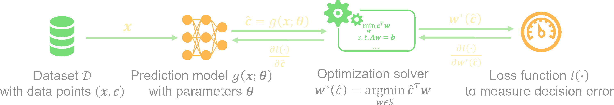

Introduction
++++++++++++

``PyEPO`` is a Python library for predict-then-optimize. It targets problems where a model predicts the objective coefficients of an optimization problem whose feasible region is fixed.

End-to-End Predict-then-Optimize Framework
------------------------------------------

Given a labeled dataset :math:`\mathcal{D}` of feature-cost pairs :math:`(\mathbf{x}, \mathbf{c})` or feature-solution pairs :math:`(\mathbf{x}, \mathbf{w})`, a neural network is trained to directly minimize the decision error, rather than the prediction error of cost coefficients.

New to predict-then-optimize? Start with :doc:`getting_started/workflow`.

Key Concepts
------------

The main objects in a PyEPO training pipeline are:

* ``pyepo.dsl``: define the problem symbolically once and compile it to any backend.
* ``optModel``: an optimization model with fixed constraints and a predicted linear objective.
* ``optDataset``: a dataset that stores features, costs, optimal solutions, and optimal objective values.
* ``pyepo.func``: PyTorch training methods that call the optimization model during training.
* ``pyepo.func.jax``: JAX versions of the training methods.
* ``pyepo.metric``: decision-quality metrics, including regret and unambiguous regret.

Backends and Training Methods
-----------------------------

``PyEPO`` builds optimization models with `GurobiPy <https://www.gurobi.com/>`_, `COPT <https://www.shanshu.ai/copt>`_, `Pyomo <http://www.pyomo.org/>`_, `Google OR-Tools <https://developers.google.com/optimization>`_, and `MPAX <https://github.com/MIT-Lu-Lab/MPAX>`_ (a JAX-based solver for GPU batch solving), and exposes them through PyTorch and JAX training frontends. Training methods are grouped into the following families:

* **Surrogate losses**: smart predict-then-optimize+ (SPO+), perturbation gradient (PG)
* **Perturbed methods**: differentiable perturbed optimizer (DPO), perturbed Fenchel-Young loss (PFYL), implicit maximum likelihood estimator (I-MLE), adaptive implicit maximum likelihood estimator (AI-MLE)
* **Regularized methods**: L2-regularized Frank-Wolfe (RFWO), L2-regularized Frank-Wolfe with Fenchel-Young loss (RFYL)
* **Black-box methods**: differentiable black-box optimizer (DBB), negative identity backpropagation (NID)
* **Cone-aligned estimation**: cone-aligned vector estimation (CaVE); binary linear programs only, with binding constraints extracted by a Gurobi-backed model
* **Contrastive methods**: noise contrastive estimation (NCE), contrastive MAP (CMAP)
* **Learning to rank**: pointwise, pairwise, and listwise learning to rank (LTR)

For guidance on picking a method, see the *Choosing a Method* section of :doc:`getting_started/function`.

Publication
-----------

``PyEPO`` is the official implementation of the paper `PyEPO: A PyTorch-based End-to-End Predict-then-Optimize Library for Linear and Integer Programming <https://link.springer.com/article/10.1007/s12532-024-00255-x>`_ (Mathematical Programming Computation, 2024).

Citation
--------

If you use ``PyEPO`` in your research, please cite it; the BibTeX entries are collected in :doc:`ref`.
